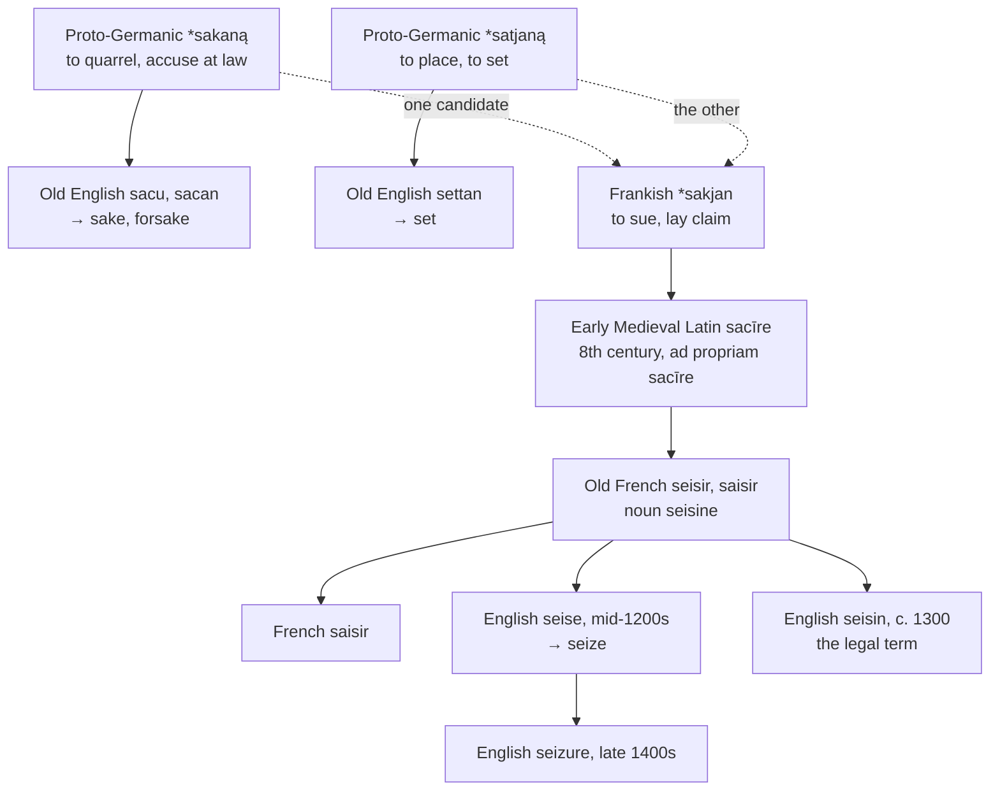

# \**Sakjan*: to lay claim

A study of a Frankish legal term that became French and then English, of the two Germanic verbs it might be, and of a phrase in every English speaker's mouth that once meant *for the lawsuit of*.

---

## 1. The root, or one of two

Early Medieval Latin had **sacīre** "to lay claim to, to take possession," attested from the eighth century in the legal phrase *ad propriam sacīre*, "to take as one's own." It is not a Latin word. It is Frankish, written down by clerks who needed a term for a Germanic legal procedure that Roman law had no name for.

Which Frankish word is disputed, and the two candidates lead to very different English relatives.

**The first is \**sakjan* "to sue, to bring a legal action,"** from Proto-Germanic \**sakaną* "to quarrel, to accuse, to claim at law." Its cognates are Old English *sacan* "to quarrel, to claim by law, to accuse," Old Saxon *sakan*, and Old High German *sahhan*. On this account *seize* belongs with English **sake** and **forsake**.

**The second is \**satjan* "to place, to set,"** from Proto-Germanic, giving Gothic *satjan*, German *setzen*, and English **set**. On this account to seize a thing is to set yourself upon it.

Wiktionary and Etymonline give both and choose neither; the Oxford Dictionary settles for "from a Germanic base meaning *procedure*." The word is certainly Germanic and certainly legal, and beyond that the trail runs cold.

---

## 2. For the sake of a lawsuit

If the first etymology is right, the family is one an English speaker uses daily without noticing.

Old English **sacu** meant "a lawsuit, a legal action, a cause." The phrase *for the sake of* is that noun — originally *on account of the legal case of*, and only later *on behalf of, for the benefit of*. *For God's sake* is a plea entered on God's behalf.

**Forsake** is *for-* plus *sacan*: to quarrel against, to renounce, to deny. And *sake* survives in its old sense in the compound *sakeless*, "innocent," now dialectal.

The related **seek**, Old English *sēcan*, is from a different Proto-Germanic verb, \**sōkijaną*, though the two roots are often connected.

---

## 3. Seisin

*Sacīre* entered Old French as **seisir**, later *saisir*, and the noun **seisine**. Both crossed into English in the thirteenth century as legal terms, and the noun is still one.

**Seisin** — also spelled *seizin* — is the right of legal possession of a freehold, distinct from ownership. It named the completion of the ceremony of feudal investiture, by which a tenant was formally admitted to his holding. A man was *seised of* his land, and the phrase appears throughout the inquisitions post mortem.

French preserves the concept in a formula still quoted in civil law: **le mort saisit le vif** — the dead give seisin to the living, meaning that an heir's possession begins at the instant of death with no interval.

The general senses came later. "To grip with the hands or teeth" is from about 1300, "to take by force" from the mid-fourteenth century, "to grasp with the mind" only from 1855, and the mechanical sense — an engine seizing up — from 1878.

**Seizure** is the noun of action, *seize* plus *-ure*, from the late fifteenth century. Its medical sense, a sudden attack of illness, is attested from 1779 and is the figurative use of an assault coming upon a person.

---

## 4. The word stayed in France

A Germanic word borrowed into Gallo-Romance usually spread from there into the rest of Romance. This one did not. **French and English are the only languages that have it.**

| | To seize | From |
|---|---|---|
| **French** | *saisir* | Frankish, through *sacīre* |
| **Spanish** | *asir*, *incautar*, *apoderarse* | Latin *ansa*; *in* + *cautum*; *poder* |
| **Portuguese** | *agarrar*, *apreender* | *garra* "claw"; *apprehendere* |
| **Italian** | *afferrare*, *sequestrare* | *ferrum* "iron"; *sequestrāre* |
| **Catalan** | *agafar*, *confiscar* | *gafa* "hook"; *cōnfiscāre* |
| **English** | *to seize* | Frankish, through French |
| **Inglisce** | *to seise* | Frankish, through French |

The Iberian and Italian words are built on nouns for the instruments of gripping — a handle, a claw, an iron, a hook — or on Latin legal verbs of confiscation. None of them borrowed the Frankish term, because none of them inherited the Frankish law that needed it. *Seisin* is a feudal institution of the north, and the word went where the institution went.

---

## 5. The spelling

English wrote **seise** first, and the modern *seize* is the later form. The older spelling did not disappear: **it survives in law**, where a person is *seised of* an estate and the noun is *seisin*. So English holds one word in two spellings, divided by register rather than by sense.

*Seize* is also one of the standing exceptions to the rule about *i* before *e*. The rule permits `ei` after `c`; *seize* has no `c`, and joins *weird*, *either*, *neither*, *leisure*, *protein*, and *caffeine* in the list of words that break it.

---

## 6. The comparative set

| | The verb | The act | The legal possession |
|---|---|---|---|
| **Medieval Latin** | *sacīre* | — | *sacīmentum* |
| **French** | *saisir* | *la saisie* | *la saisine* |
| **English** | *to seize*, *to seise* | *the seizure* | *the seisin* |
| **Inglisce** | *to seise* | *þa seișure* | *þa seisine* |

French *saisir* is a second-group verb — *je saisis*, *nous saisissons* — and carries the extended stem through much of its paradigm. English took the bare stem and conjugates it regularly, so the *-iss-* that shows in *finish* and *punish* never attached here.

French also extended the word in two directions English did not. **Saisir** in cooking is to sear — to seize the surface of the meat — and in computing it is to enter or key in data, the operator laying hold of the text.

---

## 7. The Inglisce forms

| English | Inglisce |
|---|---|
| seize, seise | `seise` |
| seizure | `seișure` |

**`Seise` is the older English spelling and the legal one.** Middle English wrote *seisen*, *sesen*, and *saisen*; the form with `s` is the original and is still current in conveyancing. Taking it costs nothing and settles a doublet English maintains for no reason but habit.

The `s` between vowels is /z/ by the ordinary rule, so `seise` reads /siz/ without further marking. English `z` states the same sound and hides the letter the word descends from.

**`Seișure` is the same consonant, palatalised.** *Seizure* is /ˈsiʒər/: the /z/ of *seise* met a following yod and became /ʒ/. The mark records what happened to it, so `seise` and `seișure` show one consonant in two states — where English writes `z` and `z` and leaves the reader to discover that they are not the same sound.

**The `ei` is kept.** *Seize* is a famous exception to the rule about `i` before `e`, but the exception is only to a rule about spelling; the digraph itself is the one Old French wrote in *seisir*, and it is correct here for the same reason it is correct in *ceiling*.
