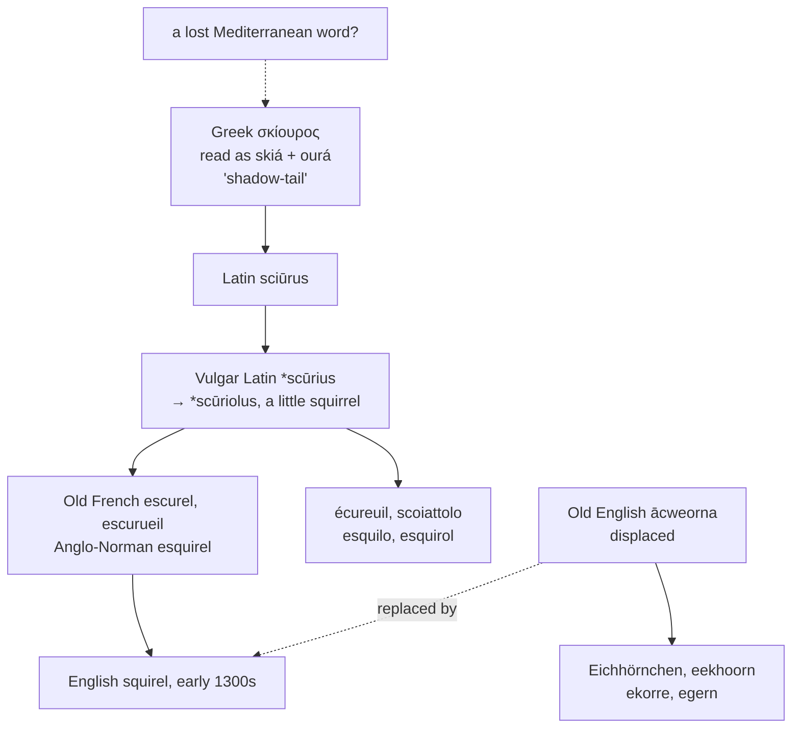

# *Sciūrus*: the shadow-tail that probably isn't

A study of an animal whose Greek name was explained by a story, whose Germanic name was explained by a different story, and which English gave up its own word for.

---

## 1. The Greek name and its story

Ancient Greek **σκίουρος** *skíouros* is the name of the squirrel, and the traditional analysis is charming: *skiá* "shadow" plus *ourá* "tail," the *shadow-tailed one*. The animal sits upright and lifts its tail over its back, and the explanation writes itself — it carries its own shade.

Merriam-Webster gives it, Etymonline gives it, and it has been repeated since antiquity.

**Beekes does not believe it.** In his etymological dictionary of Greek he observes that the derivation "looks like a folk etymology rather than a serious explanation" — that is, that *skíouros* is most likely a borrowing from some non-Greek language of the Mediterranean or Anatolia, reshaped by Greek speakers into two words they recognised.

If so, the tail and the shadow were read into the name after the fact, and what the word originally meant is lost.

The second element is at least genuinely Greek where it appears elsewhere: *ourá* "tail" descends from Proto-Indo-European \**ors-* "backside," which also gives English *arse*.

---

## 2. Latin borrows it, and shrinks it

Latin took the Greek as **sciūrus**, and it remains the scientific name of the genus; the family is *Sciuridae*.

Vulgar Latin then produced a variant \**scūrius* and, from it, the diminutive **\*scūriolus** — a little squirrel. The diminutive is what Romance inherited, and every western form descends from it rather than from the classical noun.

Old French made *escurel* and *escurueil*, Anglo-Norman *esquirel*. English took the Anglo-Norman form in the early fourteenth century and dropped its initial vowel, giving *squirel*.

The Middle English spellings are numerous — *squirel*, *squyrelle*, *squerel*, *squirile* — and the modern one settled late.

---

## 3. The word English gave up

Old English had its own name for the animal: **ācweorna**, later *ācwern*, which survived into Middle English as *aquerne* before the French word displaced it.

Every other Germanic language kept theirs:

| Language | Word |
|---|---|
| German | *Eichhörnchen* |
| Dutch | *eekhoorn* |
| Swedish | *ekorre* |
| Danish | *egern* |
| Norwegian | *ekorn* |
| Icelandic | *íkorni* |

**And the Germanic word was folk-etymologised too.** Proto-Germanic \**aikwernô* is opaque, and German speakers reanalysed it as *Eiche* "oak" plus *Hörnchen* "little horn," which is what *Eichhörnchen* now transparently means and what it never meant. The animal has no horns.

So the two great naming traditions of Europe each took an inherited word they could not parse and invented a compound for it — a shadow-tail in Greek, an oak-horn in German. English, having discarded its own, took a French diminutive and was spared the trouble.

---

## 4. The comparative set

| | Singular | Plural | Continues |
|---|---|---|---|
| **Latin** | *sciūrus* | *sciūrī* | the Greek |
| **Vulgar Latin** | \**scūriolus* | — | the diminutive |
| **French** | *l'écureuil* | *les écureuils* | \**scūriolus* |
| **Italian** | *lo scoiattolo* | *gli scoiattoli* | \**scūriolus* |
| **Portuguese** | *o esquilo* | *os esquilos* | \**scūriolus* |
| **Catalan** | *l'esquirol* | *els esquirols* | \**scūriolus* |
| **English** | *the squirrel* | *the squirrels* | \**scūriolus* |
| **Inglisce** | *þe scuirole* | *þe scuirols* | \**scūriolus* |

**Two Romance languages left the family entirely.** Spanish uses *la ardilla*, from a pre-Roman word of the peninsula, probably \**harda*; Romanian uses *veverița*, which is Slavic. Neither has any connection to *sciūrus*.

**The initial cluster divides the rest.** Italian kept the Latin *sc-* outright in *scoiattolo*. Portuguese and Catalan added a supporting vowel before it, giving *esquilo* and *esquirol*, as Iberian Romance regularly does with an initial *s* plus consonant — *escuela*, *estar*, *espada*. French did the same and then lost the *s*, leaving *écureuil* with the accent marking where it went. English took the Iberian-shaped Anglo-Norman *esquirel* and dropped the vowel from the front instead of the *s* from the middle.

Four languages, four different treatments of the same two consonants.

---

## 5. The Inglisce form

**`Scuirole` restores the Latin cluster.** *Sciūrus* and \**scūriolus* begin with *sc-*, and so does Italian *scoiattolo*; English writes *squ-* because it took the word from Anglo-Norman, where a supporting *e-* had been added and the cluster respelled. Dropping that vowel left *squ-*, which is the Latin *sc-* wearing a French disguise.

`Sc` plus `ui` gives /skwɪ/, the `u` writing the labial glide — and it is the `u` of \**scūriolus*, not an intruder.

**The `o` is the diminutive.** The suffix of \**scūriolus* is *-olus*, the same one in *filiolus* and *malleolus*. English reduces the vowel to a schwa and writes it `e`; Inglisce writes `o`, which states the same schwa and keeps the suffix visible. `Scuirole` therefore shows the stem and the diminutive as separate things, where English *squirrel* shows a single unanalysable lump.

The word is a monosyllable for many American speakers, /ˈskwɝl/, and two syllables elsewhere, /ˈskwɪrəl/; the spelling accommodates both, the `o` reducing to nothing where the speaker reduces it.

**The plural drops the silent `-e`**, giving `scuirols` — which is, letter for letter, the Catalan *esquirols* without its supporting vowel.

The article is masculine, `þe`.
