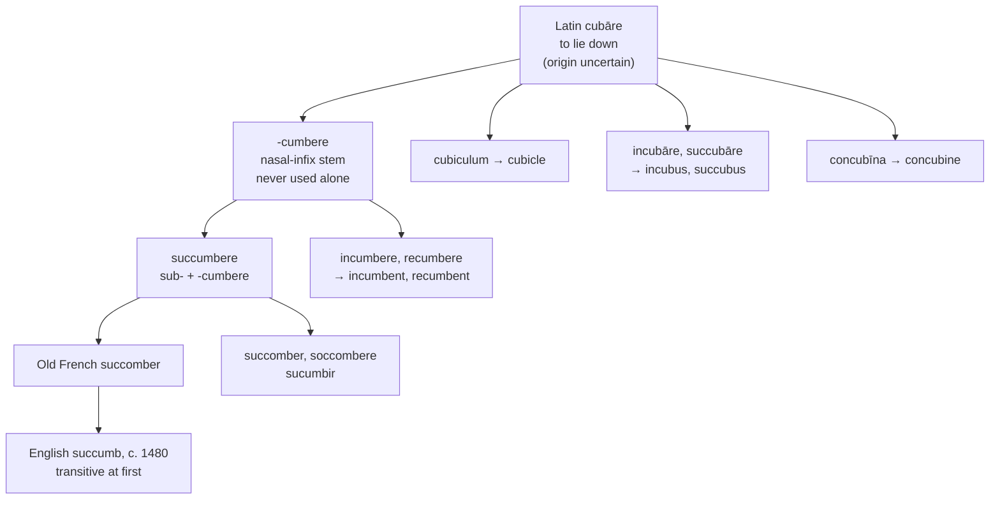

# *Succumbere*: to lie down under

A study of a Latin verb that never appears by itself, of the demon that shares its prefix, and of a letter English writes and has never once pronounced.

---

## 1. The root

Latin **cubāre** means "to lie down, to recline." Its own ancestry is not settled: a Proto-Indo-European \**kub-* has been proposed, with Middle Welsh *kyscu*, Middle Cornish *koska*, and Middle Breton *cousquet* "to sleep" as cognates, but de Vaan regards the derivation as uncertain.

From *cubāre* Latin built a second stem, **-cumbere**, with a nasal infix — the *m* inserted into the root, present in this form and absent from *cubāre* itself. The pattern is the ordinary Latin one, the same that gives *vincō* against *victum* and *rumpō* against *ruptum*.

**But *-cumbere* never stands alone.** There is no Latin verb \**cumbere*. The form exists only with a prefix in front of it, and every English word from it therefore arrives already compounded:

| Latin | Literally | English |
|---|---|---|
| *sub-* + *-cumbere* | to lie down under | **succumb** |
| *in-* + *-cumbere* | to lie down upon | **incumbent** |
| *re-* + *-cumbere* | to lie back | **recumbent** |
| *ad-* + *-cumbere* | to lie beside | **accumbent** |
| *dē-* + *-cumbere* | to lie down away | **decumbent** |
| *prō-* + *-cumbere* | to lie forward | **procumbent** |

An **incumbent** is one who lies upon an office — that is, occupies it. To **succumb** is to lie down beneath something. The bodily posture is in every one of them, and English keeps it literal in *recumbent* and figurative in the rest.

---

## 2. The lying-down family

*Cubāre* itself gave a second set, and the members are less respectable.

| Latin | Literally | English |
|---|---|---|
| *cubiculum* | a place for lying down | **cubicle** |
| *in-* + *cubāre* | to lie upon | **incubate**, **incubator**, **incubus** |
| *sub-* + *cubāre* | to lie beneath | **succubus** |
| *con-* + *cubāre* | to lie with | **concubine** |

**Succumb and succubus are the same prefix on the same root.** One is *sub-* on the nasal stem and the other *sub-* on the plain one, and both mean lying underneath — the first figuratively, the second not.

An **incubus** presses down from above and an **incubator** keeps eggs warm by lying on them; both are *in-* plus *cubāre*, and the demon and the hospital device are named identically.

A **cubicle** was a Roman bedroom before it was an office partition, and the modern sense — attested from the 1920s — restored a word that had meant a sleeping compartment for four hundred years.

**Cucumber is not related**, despite the resemblance, and neither is **cube**, which is Greek *kýbos*.

---

## 3. English had it backwards first

*Succumb* entered English about 1480, in Caxton, and it was **transitive**: to succumb a thing was to bring it down, to lay it low. That sense is now obsolete.

The modern intransitive — to sink under pressure, to give way — is recorded from about 1600. The euphemism for dying, *succumbed to his injuries*, is later still, from 1834, and is a specialisation of the figurative use with disease as the agent.

So the word reversed its direction. The Latin *succumbere* was intransitive, English made it transitive on arrival, and then English changed its mind and returned to the Latin construction a century later.

---

## 4. The comparative set

| | The verb | The prefix | The *b* |
|---|---|---|---|
| **Latin** | *succumbere* | *suc-* | sounded |
| **French** | *succomber* | *suc-* | sounded |
| **Italian** | *soccombere* | *soc-* | sounded |
| **Spanish** | *sucumbir* | *su-* | sounded |
| **Portuguese** | *sucumbir* | *su-* | sounded |
| **Catalan** | *sucumbir* | *su-* | sounded |
| **English** | *to succumb* | *suc-* | silent |
| **Inglisce** | *to succome* | *suc-* | absent |

**Three treatments of the prefix.** French keeps the Latin assimilation, *sub-* to *suc-*, with the doubled consonant. Italian keeps the doubling and lowers the vowel to *o*, as it regularly does — *soccorrere*, *sostenere*, *sottoporre*. Iberian Romance simplified the doubled letter and writes a single *c*.

**The conjugation moved twice.** Latin *succumbere* is third conjugation. Italian kept it there. French moved it to the first, *-er*. Spanish, Portuguese, and Catalan moved it to the third in their own reckoning, *-ir*.

**Every Romance language pronounces the *b* and English does not.** They kept an infinitive ending, so the consonant stands before a vowel and is sounded. English truncated the word to *succumb*, leaving the *b* at the end where it cannot be said — and no inflected form recovers it either, since *succumbs*, *succumbed*, and *succumbing* are all /m/ with nothing after it.

---

## 5. The Inglisce forms

### The *b* appears where it is said

| English | Inglisce | The *b* |
|---|---|---|
| succumb | `succome` | absent |
| incumbent | `incombent` | present |
| recumbent | `recombent` | present |
| accumbent | `accombent` | present |
| decumbent | `decombent` | present |
| procumbent | `procombent` | present |

This is the whole of the rule, and it is the same rule the Romance languages follow without stating it.

A *b* before a vowel is pronounced: *incumbent* is /ɪnˈkʌmbənt/, and `incombent` writes it. A *b* at the end of a word after *m* is not pronounced, in this word or in any other — *lamb*, *limb*, *thumb*, *comb*, *tomb*, *climb* — and `succome` leaves it out.

English writes the letter in both positions and sounds it in one. The difference is not a fact about the words but a fact about what follows the letter, and the spelling can simply obey it.

The *b* of *succumb* is genuine, unlike the inserted *b* of *debt* or the intrusive one of *thumb*; it is the consonant of *-cumbere*, stranded when English cut off the infinitive ending. But a real letter that is never audible in any cell of the paradigm records nothing a reader can use.

### The vowels

**The prefix keeps its `u` and the stem takes `o`.** `Succ-` records *sub-* assimilated before *c*, as French and Italian both do with the doubled consonant.

The `o` of `-come` and `-combent` is /ʌ/, and English already writes it that way in *come*, *some*, *son*, *done*, *none*, *month*, *money*, *honey*, and *love*. The convention began with Norman scribes, who avoided `u` next to `m`, `n`, `v`, and `w` because those letters were written as identical vertical strokes and a run of them was unreadable. Writing `o` broke up the sequence — and a `u` before `m` is precisely the case it exists for.

### The *cubāre* words

| English | Inglisce | Plural |
|---|---|---|
| cubicle | `þe cúbicle` | `cúbiculs` |
| incubate | `incubait` | — |
| incubator | `incubaitor` | `incubaitors` |
| incubus | `þi incubus` | `incubî` |
| succubus | `þe succubus` | `succubî` |
| concubine | `þe concubîn` | `concubîns` |

**`Cúbicle` and `cúbiculs` restore the Latin stem in the plural.** The acute marks the stressed /ju/, and where the singular writes the reduced syllable as `-le`, the plural writes it as `-cul-` — which is the *-cul-* of *cubiculum* itself. English *cubicles* buries it.

**`Concubîn` uses the circumflex instead of a final `-e`.** The silent `-e` is available to monosyllabic nouns and to verbs; this word is neither, so the accent fixes the `î` as /aɪ/ and the word ends where it ends. English writes a final `e` that marks a vowel three letters back, which is a long reach for one letter.

**`Incubus` and `succubus` are left as Latin**, being Latin nouns in English use and declined as such by anyone who declines them at all. They also keep the family visible: `succome` and `succubus` share a prefix, and `incombent` and `incubus` share a root.

**`Incubait` and `incubaitor` take the verb's `-ait`**, so the agent noun is transparently built on the verb — and the same stem shows in `incubus`, which English hides behind a difference of vowel it does not write.
