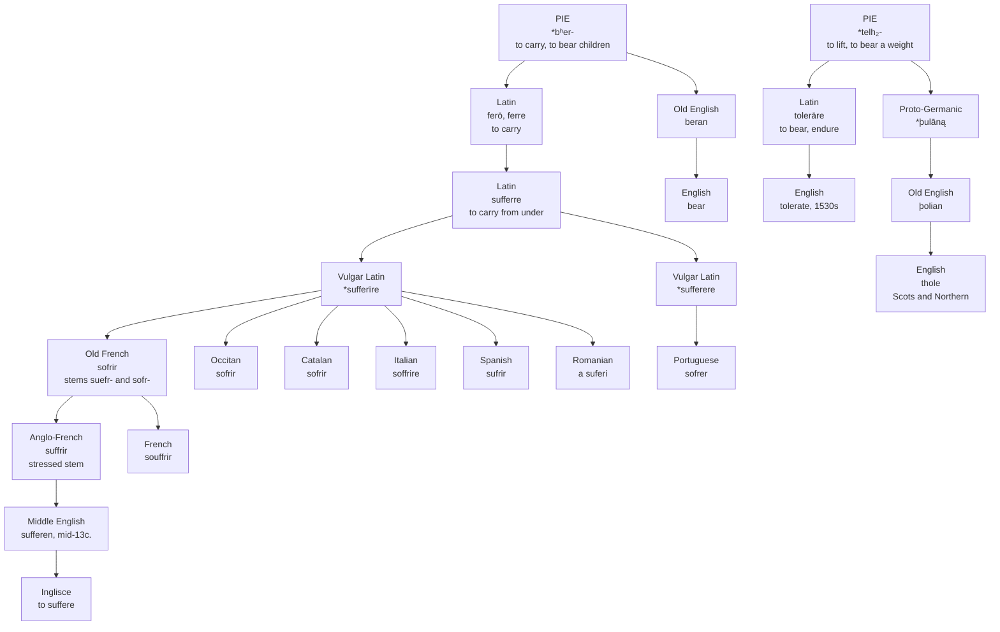

# *Sufferre*: two roots for one burden

A study of a Latin verb assembled out of two Indo-European words for carrying, of the four English words that came out of it, and of one that only looks as though it did.

---

## 1. The verb with no single root

Latin **ferō, ferre, tulī, lātum** — "I carry, to carry, I carried, carried."

Those four principal parts do not belong to each other. *Ferō* and *ferre* descend from Indo-European *\*bʰer-*, "to carry," and also "to bear children." *Tulī* and *lātum* come from *\*telh₂-*, "to lift, to support, to bear a weight." Latin held a single paradigm together by taking its own past tense from a different verb. This is suppletion, and it happens to the words a language uses hardest — English *go* takes *went* from *wend* for the same reason. A speaker conjugating *ferre* was moving between two ancient words for carrying with no way of knowing it, and both of them have separate descendants in English.

*\*telh₂-* is the more visible of the two once pointed out. Latin **tollere**, "to raise," is on it, and so is **tolerāre**, "to bear, sustain, endure." Greek has *tlēnai* "to endure," *tálanton* "a balance, a pair of scales," and **Átlas**, the Bearer, who holds up the sky. Sanskrit *tulā* is a set of scales. The root's whole field is weight and what holds it up.

**Sufferre** is *sub-* plus *ferre*: to carry from underneath. The prefix assimilates before *f*, which is where both the doubled consonant and the *u* of the attested form come from. The image is physical and specific — not carrying a thing along, which is plain *ferre*, but standing under it and holding it up, the posture of a caryatid or of Atlas in the other root.

The derivatives are in place by Late Latin. **Sufferentia** gives *sufferance*, in English by about 1300 in two senses at once: the enduring of hardship, and the tolerating of a wrong by declining to forbid it. **Sufferabilis** gives *sufferable*, which by the middle of the fourteenth century meant *permissible* rather than *endurable*.

---

## 2. Vulgar Latin rebuilds the verb

*Ferre* was athematic and profoundly irregular, and no Romance language kept it. The compounds survived only by being remade as ordinary verbs, and the remaking happened twice.

Most of Romance produced **\*sufferīre**, a fourth-conjugation verb. Iberia also produced **\*sufferere**, on the second.

The split is still legible. French *souffrir*, Occitan *sofrir*, Catalan *sofrir*, Italian *soffrire*, Spanish *sufrir* and Romanian *a suferi* all continue the *-īre* remake, and Romanian's is a fourth-conjugation verb to this day. Portuguese *sofrer* alone continues *-ere*, by way of Old Galician-Portuguese *sofrer*; Old Leonese had the same.

Catalan kept a trace of what was discarded. Beside Old Catalan *sofrir* and *soferir* there stood the variant **soferre**, taken straight from Latin *sufferre* without the remake — the athematic verb still standing, briefly, next to its replacement.

---

## 3. Two stems, and the one English took

Old French **sofrir** did not have one stem. It had two: **suefr-** under stress, **sofr-** unstressed. A speaker met *sofrir* in the infinitive and *suefr-* in the present, and the alternation was automatic.

That is the origin of the vowel disagreement running through the whole family. Modern French generalized the stressed stem and reached *souffrir*; Occitan, Catalan, Italian and Portuguese generalized the unstressed one. Old Occitan is on record with both, *soffrir* and *suffrir* side by side, which is what a language looks like before it has chosen. Littré's list of the northern dialects preserves the same picture from the other side: Berry *soffrir*, Walloon *sofri*, Burgundian *sôfri*.

Anglo-French had **suffrir**, on the stressed stem, and Anglo-French is what English copied. *Sufferen* is on record from the middle of the thirteenth century, with the senses ranged exactly as Latin left them: to bear, to endure, to resist, and also to permit, to tolerate, to allow.

It replaced two native verbs, **þolian** and **þrowian**.

*Þolian* is not entirely gone. It became Middle English *tholen* and survives as **thole**, archaic in standard English but ordinary in Scots and Northern English, where it still means to put up with something without complaining. Middle English also had *tholemode* "patient," *tholemodeness* "patience in adversity," and the splendid *untholemodnes*, which glossed Latin *inpacientia* and named as a sin the refusal to hear what one deserves.

English's adoption of *suffer* is bound up with the Passion and with the literature of martyrdom, and the sense development follows that use: submitting meekly by the early fourteenth century, undergoing affliction without giving way by the middle of it.

---

## 4. Four words, two roots

Here is what English ended up holding.

From *\*bʰer-*, natively: **bear**, from Old English *beran*, which still carries the whole sense in *I can't bear it*.

From *\*bʰer-*, borrowed through French: **suffer**.

From *\*telh₂-*, natively: **thole**, from Old English *þolian*, now regional.

From *\*telh₂-*, borrowed from Latin: **tolerate**, first attested in the 1530s of authorities allowing what they could have prevented.

So English has two native words for enduring and two borrowed ones, and the four fall into cognate pairs that cross the native/borrowed line rather than running along it. *Bear* and *suffer* are the same word. *Thole* and *tolerate* are the same word.

And the displacement went crosswise. The imported *\*bʰer-* word drove out the native *\*telh₂-* word, while an imported *\*telh₂-* word arrived three centuries later to occupy part of the ground the native one had held. In the sixteenth century a writer who wanted to say *allow without interfering* could reach for *suffer* or *tolerate* and be using, without knowing it, the two halves of a single Latin verb's paradigm.

---

## 5. The sense that came first

The earliest recorded English sense of *suffer* is not being hurt. It is allowing something to happen and declining to stop it.

That is the sense Tyndale used in 1526 rendering Second Corinthians: *For ye suffre foles gladly because that ye youreselves are wyse*. It is why *suffer fools gladly* is fixed in the language in a shape that no longer parses, why *on sufferance* means tolerated rather than tormented, and why the King James *suffer the little children to come unto me* is an instruction to get out of the way.

The general modern sense — to undergo, to be affected by, to be acted on — is late fourteenth century, and only then does the word settle into pain. The route is short and it is the same one *tolerate* would travel two hundred years later: from permitting a thing, to putting up with it, to being hurt by it.

---

## 6. The word that only looks like it

**Suffrage** is not in this family, and the only thing it shares with *suffer* is the prefix.

Latin **suffragium** meant a voting tablet, a ballot, a vote, and then the right to vote. Its second element is disputed and has never been *ferre*. The traditional derivation is *fragor* "crash, din, shouts of approval," related to *frangere* "to break" — either a broken potsherd serving as a ballot, or the noise of acclamation itself. William Smith rejected that account; Eduard Wunder proposed instead *suffrago*, the hock or knuckle-bone of a hind leg, on the notion that pastern bones were used as voting tokens. Both candidates lead back to *\*bʰreg-*, "to break," and not to *\*bʰer-*, "to carry."

The word's own career is worth noting. By the second century *suffragium* had come to mean patronage, influence, support; by the fourth it named an intercession, a request for a patron's influence with heaven; by the fifth and sixth it had slid as far as the bribe paid to secure an appointment. English took it in the late fourteenth century in the ecclesiastical sense of prayers offered on another's behalf, and only recovered the Roman meaning of a vote in the seventeenth. The sense "right to vote" is first found in the United States Constitution.

Every Romance reflex keeps the *u*: French *suffrage*, Italian *suffragio* and *suffragare*, Spanish *sufragio* and *sufragar*, Portuguese *sufrágio* and *sufragar*, Catalan *sufragi* and *sufragar*. There is no *o* form anywhere, and the reason is the substance of section 3 — these are learned borrowings taken straight from Latin, which never passed through the Old French stem alternation at all.

So *suffer* and *suffrage* do share something real. It is *sub-*, assimilated to *suf-* before an *f*, in two words whose stems have nothing to do with each other.

---

## 7. The comparative set

| Language | Verb | Remade stem | Stem vowel |
| :--- | :--- | :--- | :--- |
| **Inglisce** | to suffere | *\*sufferīre*, by way of Anglo-French | u |
| English | to suffer | *\*sufferīre*, by way of Anglo-French | u |
| French | souffrir | *\*sufferīre* | ou |
| Occitan | sofrir | *\*sufferīre* | o |
| Catalan | sofrir | *\*sufferīre* | o |
| Italian | soffrire | *\*sufferīre* | o |
| Spanish | sufrir | *\*sufferīre* | u |
| Romanian | a suferi | *\*sufferīre* | u |
| Portuguese | sofrer | *\*sufferere* | o |

Read the last two columns down and they cut the set in different places. Eight languages took the *-īre* remake and Portuguese alone took *-ere*, but Portuguese sits with Italian, Occitan and Catalan on the vowel, and Spanish sits with English. Neither column predicts the other, and neither follows the map of Romance. This is what a verb rebuilt from scratch in several places at once looks like: the conjugation was settled by whichever pattern was productive locally, the vowel by which stem of an alternating paradigm each language chose to keep, and the two decisions had nothing to do with each other.

---

## 8. The Inglisce forms

**to suffere** · sufferes, suffered, suffering · **sufferor** · sufferable, insufferable, sufferance
**suffrage** · suffragist, suffragan

There is no bare noun on the verb, and that is a fact about English rather than an omission. English has no *a suffer*; the nouns are *suffering*, *sufferance* and the agent noun, all built with suffixes. What the file holds is a verb and the things grown from it.

The **doubled f** is exact history. *Sub-* assimilates to *suf-* before *f*, which is why Latin has *sufferre* and not *subferre*, and French *souffrir* and Italian *soffrire* both keep the doubling. The letter records an assimilation rather than a length.

The **u** keeps the stem English actually received. Old French carried two, and both were genuine; Anglo-French passed on the stressed one, and this spelling declines to reach back past English and substitute the other. It puts the word with Modern French, Spanish and Romanian, and apart from Italian, Catalan, Occitan and Portuguese — a division that runs through the middle of Romance and cannot be resolved by preferring one side, only chosen.

The **final -e** holds the root in one shape across the whole family. *Suffer-* appears unchanged in the infinitive, the present, the past, the progressive, the agent noun, the adjective, its negation and the abstract noun. A compressed root would have taken three shapes across those eight cells, and the reader would have had to learn which one each suffix selects.

And *suffrage* keeps its *u* as well, so the two words still share their opening on the page. That is not a collision to be engineered away. It is the same prefix, assimilated the same way, before the same consonant, in two words whose stems are unrelated — and the spelling records exactly as much kinship as there is.

One last thing sits in the spelling without being written there. The word *suffer* displaced was *þolian*, and the letter it began with is in the Inglisce alphabet — restored, kept, available. The letter came back and the word did not. Standard English lost it, and only Scots and the north still thole anything.
