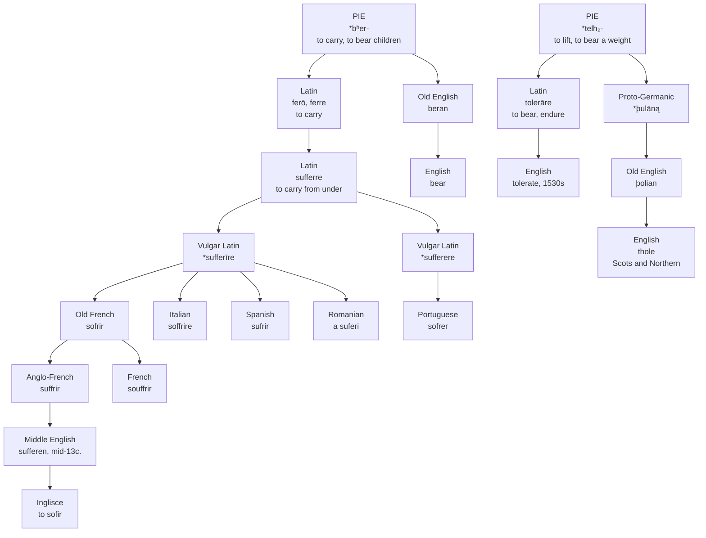

# *Sufferre*: two roots for one burden

A study of a Latin verb assembled out of two Indo-European words for carrying, and of the four English words that came out of it.

---

## 1. The verb with no single root

Latin **ferō, ferre, tulī, lātum** — "I carry, to carry, I carried, carried."

Those four principal parts do not belong to each other. *Ferō* and *ferre* descend from Indo-European *\*bʰer-*, "to carry," and also "to bear children." *Tulī* and *lātum* come from *\*telh₂-*, "to lift, to support, to bear a weight." Latin held a single paradigm together by borrowing its own past tense from a different verb.

This is suppletion, and it happens to the words a language uses hardest — English *go* takes *went* from *wend* for exactly the same reason. What matters here is that a speaker of Latin conjugating *ferre* was moving between two ancient words for carrying without any way of knowing it, and that both of those words have separate descendants in English.

*\*telh₂-* is the more visible of the two once pointed out. Latin **tollere**, "to raise," is on it, and so is **tolerāre**, "to bear, sustain, endure." Greek has *tlēnai* "to endure," *tálanton* "a balance, a pair of scales," and **Átlas**, the Bearer, who holds up the sky. Sanskrit *tulā* is a set of scales. The root's whole field is weight and what holds it.

---

## 2. The weight taken from below

**Sufferre** is *sub-* plus *ferre*: to carry from underneath. The prefix assimilates before *f*, giving the doubled consonant of the attested form. Latin used it for bearing up under a load, undergoing, enduring, and submitting to.

The derivatives are all in place by Late Latin. **Sufferentia** gives *sufferance*, in English by about 1300 in two senses at once: the enduring of hardship, and the tolerating of a wrong by declining to forbid it. **Sufferabilis** gives *sufferable*, which by the middle of the fourteenth century meant *permissible* rather than *endurable*.

The image underneath all of them is physical and specific. Not carrying a thing along, which is plain *ferre*, but standing under it and holding it up — the posture of a caryatid, or of Atlas in the other root.

---

## 3. Vulgar Latin rebuilds the verb

*Ferre* was athematic and profoundly irregular, and no Romance language kept it. The compounds survived only by being remade as ordinary verbs, and the remaking happened twice.

Most of Romance produced **\*sufferīre**, a fourth-conjugation verb. Iberia also produced **\*sufferere**, on the second.

The split is still legible in the modern forms. French *souffrir*, Italian *soffrire*, Spanish *sufrir* and Romanian *a suferi* all continue the *-īre* remake; Romanian's is a fourth-conjugation verb to this day. Portuguese *sofrer* alone continues *-ere*, by way of Old Galician-Portuguese *sofrer*, and Old Leonese had the same. Portuguese is not conservative here and not innovative either — it inherited a different Vulgar Latin verb from the one its neighbours inherited.

---

## 4. What English took, and what it threw out

Old French had **sofrir**, with the senses ranged exactly as Latin left them: to bear, to endure, to resist, and also to permit, to tolerate, to allow. Anglo-French had the variant **suffrir**, and Anglo-French is what English copied. *Sufferen* is on record from the middle of the thirteenth century.

It replaced two native verbs, **þolian** and **þrowian**.

*Þolian* is not entirely gone. It became Middle English *tholen* and survives as **thole**, archaic in standard English but ordinary in Scots and Northern English, where it still means to put up with something without complaining. Middle English also had *tholemode* "patient," *tholemodeness* "patience in adversity," and the splendid *untholemodnes*, which glossed Latin *inpacientia* and named as a sin the refusal to hear what one deserves.

English's adoption of *suffer* is bound up with the Passion and with the literature of martyrdom, and the sense development follows that use: submitting meekly by the early fourteenth century, undergoing affliction without giving way by the middle of it.

---

## 5. Four words, two roots

Here is what English ended up holding.

From *\*bʰer-*, natively: **bear**, from Old English *beran*, which still carries the whole sense in *I can't bear it*.

From *\*bʰer-*, borrowed through French: **suffer**.

From *\*telh₂-*, natively: **thole**, from Old English *þolian*, now regional.

From *\*telh₂-*, borrowed from Latin: **tolerate**, first attested in the 1530s of authorities allowing what they could have prevented.

So English has two native words for enduring and two borrowed ones, and the four fall into two cognate pairs that cross the native/borrowed line rather than running along it. *Bear* and *suffer* are the same word. *Thole* and *tolerate* are the same word.

And the displacement went crosswise. The imported *\*bʰer-* word drove out the native *\*telh₂-* word, while an imported *\*telh₂-* word arrived three centuries later to occupy part of the ground the native one had held. In the sixteenth century a writer who wanted to say *allow without interfering* could reach for *suffer* or *tolerate* and be using, without knowing it, the two halves of a single Latin verb's paradigm.

---

## 6. The sense that came first

The earliest recorded English sense of *suffer* is not being hurt. It is allowing something to happen and declining to stop it.

The permitting sense is the one Tyndale used in 1526 rendering Second Corinthians: *For ye suffre foles gladly because that ye youreselves are wyse*. It is why *suffer fools gladly* is fixed in the language in a shape that no longer parses, and why *on sufferance* means tolerated rather than tormented, and why the King James *suffer the little children to come unto me* is an instruction to get out of the way.

The general modern sense — to undergo, to be affected by, to be acted on — is late fourteenth century, and only then does the word settle into pain. The route is short and it is the same one *tolerate* would travel two hundred years later: from permitting a thing, to putting up with it, to being hurt by it.

---

## 7. The comparative set

| Language | Verb | Remade stem | Stem vowel |
| :--- | :--- | :--- | :--- |
| **Inglisce** | to sofir | *\*sufferīre*, by way of Anglo-French | o |
| English | to suffer | *\*sufferīre*, by way of Anglo-French | u |
| French | souffrir | *\*sufferīre* | ou |
| Italian | soffrire | *\*sufferīre* | o |
| Spanish | sufrir | *\*sufferīre* | u |
| Romanian | a suferi | *\*sufferīre* | u |
| Portuguese | sofrer | *\*sufferere* | o |

Read the last two columns down and they cut the set in different places. Six languages took the *-īre* remake and Portuguese alone took *-ere*, but Portuguese sits with Italian on the vowel, and Spanish sits with English. Neither column predicts the other, which is what one expects of a verb rebuilt from scratch in several places at once: the conjugation was chosen by whichever pattern was productive locally, and the vowel by ordinary sound change, and the two decisions had nothing to do with each other.

---

## 8. The Inglisce form

**to sofir** · sofre, sofres, sofred, sofiring

There is no noun here, and that is a fact about English rather than an omission. English has no bare noun *a suffer*; the nouns are *suffering* and *sufferance*, both built with suffixes on the verb. The file holds a verb and nothing else.

The **o** restores the Old French *sofrir* and puts the word with Italian *soffrire*, Portuguese *sofrer* and Catalan *sofrir*. English's *u* is not the older form and not the majority one — it is the Anglo-French variant, which is to say an accident of which side of the Channel the scribes who wrote English happened to be copying.

The **single f** does not record the Latin, and the page should be exact about this. Latin genuinely doubled the consonant, because *sub-* assimilates to *suf-* before *f*, and French and Italian both kept the doubling. The single *f* here records a distinction inside Inglisce instead, holding *sofre* apart from *coffre*. Etymology gives way to the vowel contrast at this one point.

The verb's stem vowel appears in the infinitive and the progressive, *sofir* and *sofiring*, and drops out of the present tense, *sofre* and *sofres*. The same architecture runs through the other schwa-final verb classes.

One last thing sits in the spelling without being written there. The word *suffer* displaced was *þolian*, and the letter it began with is in the Inglisce alphabet — restored, kept, available. The letter came back and the word did not. Standard English lost it, and only Scots and the north still thole anything.
