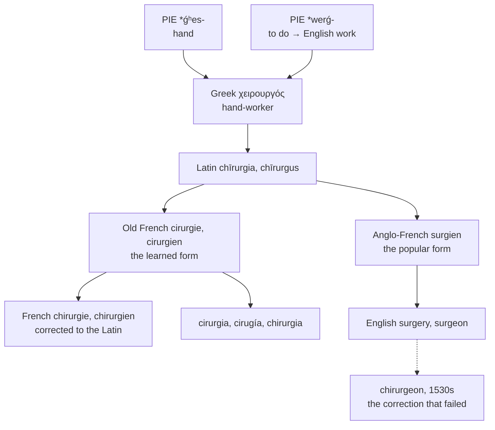

# *Kheirourgós*: the hand-worker

A study of a Greek compound meaning nothing more than *manual labour*, of the failed sixteenth-century attempt to make English spell it properly, and of the single letter that separates English from every other language in Europe.

---

## 1. The root

Greek **χειρουργός** *kheirourgós* is a plain compound of two ordinary words:

**χείρ** *kheír* "hand," from Proto-Indo-European \**ǵʰes-* "the hand." It gives English *chiral*, *chiropractic*, *chiromancy*, *chirography*, and *enchiridion*.

**ἔργον** *érgon* "work," from Proto-Indo-European \**werǵ-* "to do." This one is enormous:

| Source | English |
|---|---|
| Proto-Germanic \**werkan* | **work**, **wrought**, **wright** |
| Greek *érgon* directly | **erg**, **ergonomic** |
| Greek *en-* + *érgon* | **energy** |
| Greek *órganon* | **organ**, **organic**, **organise** |
| Greek *állos* + *érgon* | **allergy** |
| Greek *lēitos* + *érgon* | **liturgy** |
| Greek *métallon* + *érgon* | **metallurgy** |
| Greek *kheír* + *érgon* | **surgery**, **surgeon** |

So **surgery** and **work** are the same word, and the *-gery* of the one is the *work* of the other with five thousand years between them. A surgeon is a hand-worker, named in exactly the way a *wheelwright* or a *shipwright* is.

The Greeks meant it as a contrast. The *kheirourgós* worked with his hands; the physician prescribed and advised. The distinction between the two survives in the British custom of addressing surgeons as *Mr* rather than *Dr* — a fossil of the days when they were tradesmen and not gentlemen.

---

## 2. The word English got wrong, and could not fix

Latin took the Greek as **chīrurgia** and **chīrurgus**.

Old French then produced two forms side by side: a learned *cirurgie*, *cirurgien*, close to the Latin, and a worn-down popular *surgien*. Anglo-French had *surgien* by the thirteenth century, and English took that one about 1300, as *surgien* or *sorgien*.

**The 1530s tried to correct it.** Scholars, noticing that the word was Greek and ought to look it, produced **chirurgeon** — and Etymonline describes the result flatly as "a failed attempt to restore Greek spelling to the word that had got into English as surgeon." The form survives only as an archaism, in the naval and historical registers where *ship's chirurgeon* is used for period colour. *Chirurgery* and *chirurgic* went the same way.

**French made the same correction and it stuck.** Modern French *chirurgie* and *chirurgien* are the learned forms, conformed to the Latin, and the popular *surgien* died. So the two languages attempted the same repair in the same period, and it took in one and not the other.

The consequence is that English is now the only language in western Europe whose word for this begins with an *s*.

---

## 3. Three senses in one English word

*Surgery* means more in English than elsewhere, and the extra senses are English inventions.

| Sense | Elsewhere |
|---|---|
| the branch of medicine | Italian *la chirurgia*, French *la chirurgie* |
| an individual operation | Italian *l'intervento chirurgico*, French *l'opération* |
| a physician's consulting room (British) | no equivalent |
| a legislator's constituency clinic (British) | no equivalent |

Italian is explicit about the first two: *chirurgia* is the discipline, and an operation is an *intervento chirurgico*, a surgical intervention. English uses one noun for the field, the procedure, the room, and the appointment.

---

## 4. The comparative set

| | The practice | The practitioner | Initial |
|---|---|---|---|
| **Greek** | *kheirourgía* | *kheirourgós* | χ |
| **Latin** | *chīrurgia* | *chīrurgus* | *ch* |
| **French** | *la chirurgie* | *le chirurgien* | *ch* |
| **Italian** | *la chirurgia* | *il chirurgo* | *ch* |
| **Romanian** | *chirurgia* | *chirurgul* | *ch* |
| **Portuguese** | *a cirurgia* | *o cirurgião* | *c* |
| **Catalan** | *la cirurgia* | *el cirurgià* | *c* |
| **Spanish** | *la cirugía* | *el cirujano* | *c* |
| **English** | *the surgery* | *the surgeon* | *s* |
| **Inglisce** | *þe cirgerie* | *þe cirgian* | *c* |

**The initial sorts the languages into three.** French, Italian, and Romanian kept the Latin *ch*. Portuguese, Catalan, and Spanish simplified it to *c*, as Iberian Romance regularly does with the Greek digraph. English alone has *s*, and only because it took the one Old French form that had worn the consonant down that far.

**Spanish lost an *r*.** *Cirugía*, against Portuguese and Catalan *cirurgia*, shows dissimilation — one of two *r*s in successive syllables dropping out, the same process that gives Spanish *árbol* from *arborem*. Spanish also softened the agent noun's consonant to *j*, giving *cirujano* where Portuguese has *cirurgião*.

**The agent suffix is *-iānus*.** Vulgar Latin \**chīrurgiānus* underlies French *chirurgien*, Portuguese *cirurgião*, Catalan *cirurgià*, Spanish *cirujano*, and English *surgeon* — the English form having contracted *-ien* to *-eon*. Only Italian went back to the Latin noun itself, *chirurgus*, and has *chirurgo*.

---

## 5. The Inglisce forms

**`Cirgerie` and `cirgian` restore the initial consonant.** English *s-* is the endpoint of a Norman erosion that no other language underwent; `c-` puts the words back beside *cirurgia*, *cirurgià*, and *cirugía*, and within reach of *chirurgia* and *chirurgie*.

The letter also reads correctly without further marking. A `c` before `i` has its soft value, so `cirg-` is /sɝdʒ/ — the same sound English spells with an `s`, written with the letter the word actually descends from.

**The `g` is soft by the same rule**, standing before `e` in `cirgerie` and before `i` in `cirgian`, so both give /dʒ/ without a diacritic.

**`-erie` is the French abstract suffix**, as English has it in *bakery*, *nursery*, and *brewery*, and as French has it in *chirurgie* by a different route. Writing it in full keeps `cirgerie` beside `voterie` and the rest of the class, where English clips it to `-ery`.

**`-ian` records \**chīrurgiānus***, the Vulgar Latin agent noun that lies behind every form in the table. English contracted it to *-eon* and thereby lost the resemblance to *cirurgião* and *chirurgien*; `cirgian` keeps it.

**One thing the spelling cannot recover.** The *chiro-* words — *chiral*, *chiropractic*, *chiromancy* — are the same Greek χείρ, and they keep /k/ because they came into English directly from Greek rather than through French. `Cirgerie` and `chiropractic` will therefore never look alike, and should not: one consonant is /s/ and the other /k/, and a spelling that joined them would misreport both.

Both nouns are masculine, `þe`.
