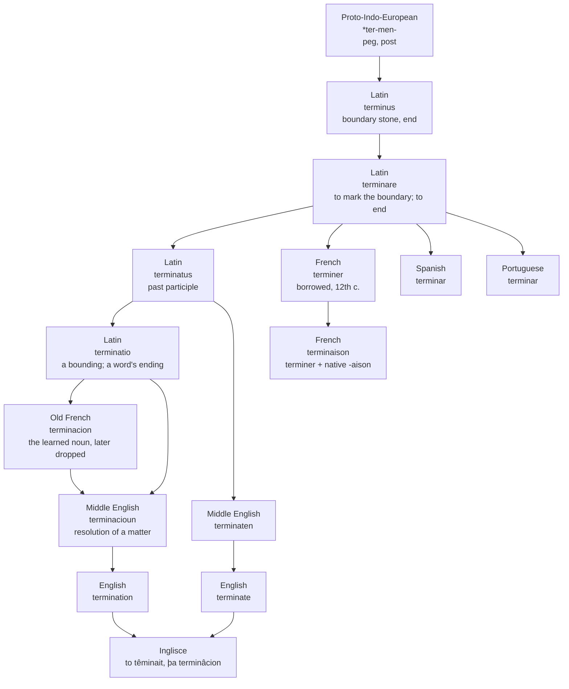

# *Terminare*: the boundary stone as an ending

How a Latin word for a marker in the ground became the verb and noun for ending things, and why French kept a different noun from the one English took.

---

## 1. The root

Latin *terminus* (plural *termini*) meant an end, a limit, a boundary line. It is reconstructed as coming from Proto-Indo-European *\*ter-men-* "peg, post," built on a root *\*ter-* that underlies words for pegs, posts, boundaries, markers and goals. Hittite, the oldest-attested Indo-European language, has the concrete sense on its own: *tarma-* "peg, nail," beside the verb *tarmaizzi* "he limits." De Vaan reads the Hittite noun and the Latin usage together: the word first named a physical object, which came to mean a boundary stone.

Rome kept the object. Terminus was the god who presided over boundaries and landmarks, and his festival, the Terminalia, fell on 23 February, the last day of the old Roman year. The stone that marked where a field stopped and the day that marked where the year stopped belonged to the same god. The shift from *boundary* to *end*, which every descendant on this page has made, was already visible in the Roman calendar.

---

## 2. The verb and its noun

From *terminus* Latin made the verb *terminare*, "to mark the end or boundary." It meant first to set bounds, to limit, and then to close or finish. Its past participle was *terminatus*, and on that participle stem Latin built the action noun *terminatio*: a fixing of boundaries, a bounding, a determining.

*Terminatio* also had a technical life. Latin used it for the end of a phrase and for the ending of a word, the part a grammarian would call a desinence. That grammatical sense will matter in French, where it is most of what the noun still means.

Every Romance verb in the set is a borrowing from Latin, not an inheritance. French *terminer* entered in the twelfth century as a loan from *terminare*, and Portuguese *terminar* is likewise a borrowing. Spanish *terminar* comes from the same Latin verb. French still has the old spatial sense in literary use, where mountains can *terminer l'horizon*, bound the horizon.

---

## 3. French: two nouns, and the one it kept

French had two nouns for this verb, and kept the one English did not take.

The first is *terminaison*, attested around 1175 in the sense "determination." The TLFi describes it as a French formation: the verb *terminer* with the suffix *-aison*, modelled on Latin *terminatio*. The suffix *-aison* is the shape French's own sound history made of Latin *-ātiōnem*, the same shape that gives *raison* from *ratiōnem* and *saison* from *satiōnem*. The noun is therefore half borrowed and half native: a learned verb with an inherited ending attached.

The second is *termination*, the learned form taken straight from Latin *terminatio*, attested in 1272 in the sense "end." This is the Old French *terminacion* that crossed into English in the late fourteenth century.

Littré tells the history in a different order: the old language said *terminance*, and *termination* was refashioned on the Latin in the sixteenth century. The TLFi dates the learned form three centuries earlier.

On either account, French let *termination* go and kept *terminaison*, and the survivor has narrowed. The Académie now marks its general sense, "the end of a thing," as rare. What is current is the final part of something: the termination of a circuit or a line, a nerve ending, and above all the ending of a word, *une terminaison en -al*. The grammatical sense that Latin *terminatio* carried is the one French *terminaison* has kept.

---

## 4. English: two verbs, a legal beginning, and a euphemism

English borrowed the verb twice. The first borrowing was *termine*, from Old French *terminier* and Latin *terminare*. It meant "to render a judgment, decide authoritatively" in the early fourteenth century, "to fix the bounds of" by the late fourteenth, and "to end" around 1400, and it is now obsolete.

The survivor, *terminate*, appears in the early fifteenth century as *terminaten*. It was built on the Latin past participle *terminatus*, not on the infinitive, which is why the English verb ends in *-ate*. Its first meanings were "to bring to an end, decide (a case)" and "to border, bound, form the extreme boundary of."

The noun arrived in the late fourteenth century as *terminacioun*. It came from Old French *terminacion* and directly from Latin *terminationem*, and meant "authoritative resolution of a matter." The plain sense "end, cessation" is recorded by about 1500. Both English words, then, began in the law court, deciding cases, before they were simply words for ending.

The twentieth century gave the pair a second career as euphemism. The chronology runs:

- **1946**: *terminate* used of war-time jobs coming to an end.
- **1955**: *terminate* used of the worker, meaning "dismiss."
- **1961**: *termination* in the sense "end of a person's employment."
- **1968**: *terminate* as a euphemism for putting a pet animal to death.
- **1969**: *termination* for the artificial end of a pregnancy.
- **1975**: *terminate* used of a fetus in an abortion, and both words used in the sense of assassination.

The word that once named a marker at the edge of a field became the administrative word for ending a job, a pregnancy or a life.

---

## 5. The comparative set

| | The verb | The noun | What the noun records |
|---|---|---|---|
| Latin | *terminare* | *terminatio* | An action noun on the participle stem: a bounding, and in grammar a word's ending |
| French | *terminer* | *terminaison* | French's own *-aison*, the inherited shape of *-ātiōnem*, fitted to a borrowed verb; the learned *termination* was dropped |
| Spanish | *terminar* | *terminación* | The Latinate suffix *-ción*, the learned shape of *-tiōnem* |
| Portuguese | *terminar* | *terminação* | *-ção*, the shape Portuguese gives *-tiōnem* in its learned vocabulary |
| English | *to terminate* | *termination* | Verb from the Latin participle; noun spelt *-cioun* on arrival and *-tion* now, after the Latin |
| Inglisce | *to têminait* | *þa terminâcion* | *-cion*, the spelling the noun had when it entered English |

**Reading the last column down:** Spanish, Portuguese and English each carry the Latin ending in the shape their learned vocabulary gives it: *-ción*, *-ção*, *-tion*. French had that learned shape for this word too, *termination*, and let it go. What French kept is *-aison*, the version its own sound history made of the ending. So the one noun in the set built on an inherited suffix belongs to the language whose learned noun English borrowed and French abandoned.

---

## 6. The Inglisce form

The Inglisce pair is *to têminait* and *þa terminâcion*. The circumflex marks the stressed syllable. The verb is stressed on its first syllable, so the mark sits on *ê*; the noun is stressed on *-na-*, so the mark sits on *â*. A stress-marked *ê* absorbs the *r* that follows it, which is why the verb is written *têmin-* while the noun, whose first syllable is unstressed, keeps *termin-*.

English writes *ter-* at the head of both words, and the two words do begin with the same vowel, /ɜː/ in British and /ɝ/ in American pronunciation. What separates them is stress: *terminate* carries its main stress on the first syllable, *termination* on the third. English leaves that difference unwritten. Inglisce writes it, and the cost is a root that appears in two shapes, *têmin-* and *termin-*, where English shows one. Spanish also puts a mark on this noun, on the *ó* of *terminación*. The Spanish and Inglisce marks fall on different syllables because the two languages stress the noun on different syllables.

The noun's ending, *-cion*, is the spelling the word had when it crossed from French: Old French *terminacion*, Middle English *terminacioun*. Modern English *-tion* follows the Latin *terminatio*. Inglisce therefore sides with the medieval route by which the noun actually arrived, and in doing so matches Spanish *-ción* letter for letter.

The verb ends in *-ait* where English writes *-ate*. The same *-na-* syllable is written *-nait* in the verb and *-nâ-* in the noun, where it carries the stress. The noun takes the article *þa*; the verb takes *to*, as English does.
