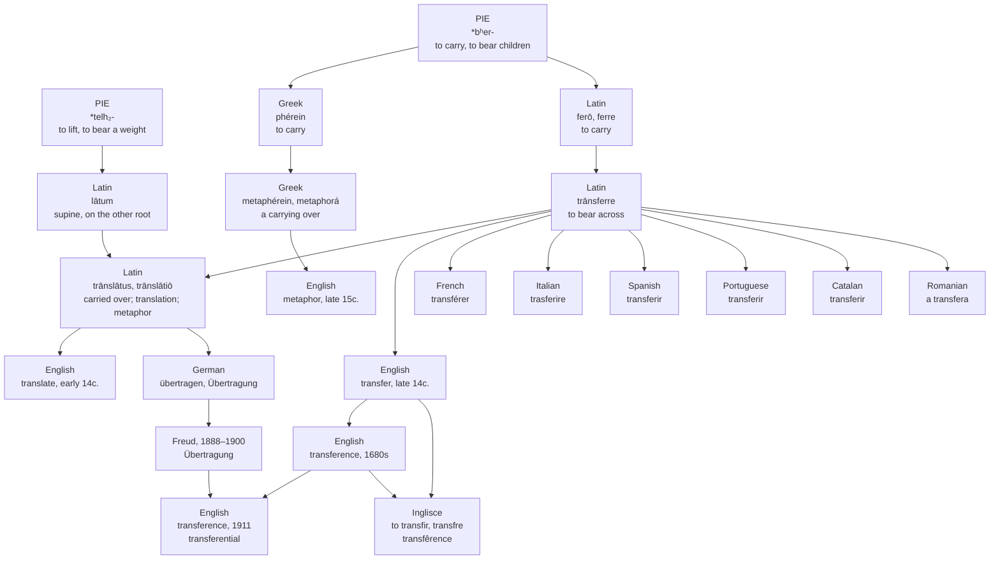

# *Transferre*: the Latin word for metaphor

A study of a verb meaning "to carry across" whose own paradigm is carried across two unrelated roots, and of the same compound built four times in four languages.

---

## 1. Across, and carry

Latin **trānsferre** is *trāns*, "across, beyond," plus *ferre*, "to carry." To bear across, to carry over, to bring through.

*Ferre* is the great suppletive verb of Latin, and its four principal parts come from two Indo-European roots that have nothing to do with each other. *Ferō* and *ferre* are on *\*bʰer-*, "to carry," the root that also gives English *bear*. The perfect and supine, *tulī* and *lātum*, are on *\*telh₂-*, "to lift, to bear a weight" — the root behind *tollere*, *tolerāre* and Greek *Átlas*.

So *trānsferre* has a past participle, **trānslātus**, that shares nothing with its present stem but the prefix. And English took both:

**Transfer** is the present stem. **Translate** is the supine.

They are the same Latin verb, and no English speaker connects them. A translated document and a transferred employee are the same operation named from the two halves of one paradigm. The word for carrying-across is itself carried across two etymologies.

---

## 2. The Greek that is the same word

Greek had built the compound already, and built it out of the same material.

**Metapherein** is *meta*, "over, across," plus *pherein*, "to carry, to bear" — and *pherein* descends from *\*bʰer-*, exactly as *ferre* does. The two verbs are not merely parallel constructions. They are cognate constructions: the same root, given equivalent prefixes, in two languages. **Metaphorá** is "a carrying over," a transfer.

Which means that when Latin wanted a word for metaphor, it did not need to borrow one. It already had the calque built. **Translātiō** in Roman rhetoric means a literal carrying-across, as of goods by ship; and linguistic translation; and metaphor. All three, one word. To *transfer* a term, for Cicero or Quintilian, was to use it metaphorically. The Romans understood translation as transformation because their vocabulary gave them no way to separate the two.

German built it a third time. **Übertragung** is *über* "over" plus *tragen* "carry", and **übersetzen** is "to set across" — native compounds that render Latin *translatio* and through it Greek *metaphorá*, and of all the modern terms *Übertragung* stands closest to the Greek etymology.

The medieval schoolmen then took the noun and applied it to history itself. **Translātiō studiī** names the westward movement of learning — Athens to Rome to Paris to London — and **translātiō imperiī** the same movement of political power, both traced to the second chapter of Daniel. Civilisation as a thing carried across. There is even a pessimist's version on record, *translātiō stultitiae*, the transfer of stupidity, following behind as night follows the light westward.

---

## 3. English takes both stems

**Translate** arrives first, early in the fourteenth century, meaning to remove something from one place to another, and also to turn one language into another. It displaced the native Old English *wending*.

**Transfer** follows late in the same century, from Old French *transferer* or directly from the Latin, meaning to relocate, to convey from one person to another, to hand over, and also to copy from one thing to another. The sense "make over the possession or control of" is from the 1590s, and the decorative-arts sense — lifting a design off one surface onto another — is on record by 1839, which is where the printed transfers of Victorian nurseries and eventually the word *transfer* on a bus ticket come from.

The noun *transfer* follows the verb, and English marks the difference between them by stress alone: tranSFER the verb, TRANSfer the noun. Same letters, different weight.

---

## 4. The couch

**Transference** is an ordinary English noun of the 1680s meaning the act of transferring. It had been in the language for two hundred and thirty years doing nothing in particular when it was given a second career.

In 1911 it was pressed into service to render Freud's **Übertragung**, and it is now hard to hear the word in any other sense. The German term had come to Freud out of nineteenth-century neurology, where it named displaceable energies, and he was using it in that sense as early as 1888 before carrying it across into the analytic relationship.

So a patient's transference onto an analyst is, at the level of the word, the same act as a metaphor: something formed for one object, carried over, and laid on another. Freud's term, Cicero's term for a figure of speech, and the Greek word for the same figure are one compound built three times. **Transferential**, the adjective, is English's own addition to the pile.

---

## 5. What Romance did

*Ferre* was athematic and irregular and no Romance language kept it, so every compound had to be taken again from the books rather than inherited. They were, and the languages did not agree on how to conjugate them.

French took the first conjugation: **transférer**. Italian, Spanish, Portuguese and Catalan took the fourth: **trasferire**, **transferir**, **transferir**, **transferir**. Romanian has **a transfera**.

Nothing in the Latin decided this. The verb arrived as a learned word in each language at roughly the same period, and each fitted it to whichever pattern was productive locally.

---

## 6. The comparative set

| Language | The verb | Conjugation | The word for metaphor |
| :--- | :--- | :--- | :--- |
| **Inglisce** | to transfir | — | — |
| English | to transfer | — | metaphor |
| French | transférer | first, *-er* | métaphore |
| Italian | trasferire | fourth, *-ire* | metafora |
| Spanish | transferir | fourth, *-ir* | metáfora |
| Portuguese | transferir | fourth, *-ir* | metáfora |
| Catalan | transferir | fourth, *-ir* | metàfora |
| Romanian | a transfera | first, *-a* | metaforă |

Read the last column down and every language has borrowed the Greek word rather than using its own. The calque was available in all of them — each has a perfectly good verb meaning *carry across*, and Latin had already demonstrated that the compound does the job — and every one of them reached for *metaphorá* instead. Only German, outside this table, kept its own compound and says *Übertragung* where the rest say *transfer*. A language will build the machinery and then import the finished product anyway.

---

## 7. The Inglisce forms

**to transfir** · transfre, transfres, transfred, transfiring
**transfre**, transfirs
**transfêrable**, **transfêrence**, **transfêral** · **transferencial**

The verb and the noun stop being the same word. English distinguishes *transfer* the verb from *transfer* the noun by stress alone, which is invisible on the page: identical letters, and only the ear knows which is meant. Here the verb compresses to *transfre* in the present and opens to *transfir* in the infinitive, while the noun is *transfre* with the plural *transfirs*. What English does with the voice, this does with the letters.

Then the verb keeps its Romance shape and everything built on it takes the Latin, which is why the derivatives return the full *-fer-* the verb had dropped.

The circumflex marks the stressed r-coloured vowel and goes where the stress goes. It sits in **transfêrable**, **transfêrence** and **transfêral**, all of which carry the weight on that syllable. It vanishes in **transferencial**, because the stress has moved forward onto *-en-* and the syllable it marked is now unstressed. The mark belongs to the beat, not to the letter, and it leaves when the beat does.

That last form does something English cannot. English leaves this word's stress genuinely unsettled: dictionaries print *transferable* both ways and *transference* both ways, and speakers differ without noticing. An orthography that marks stress cannot record an argument. It has to pick, and picking is what these spellings do — the second syllable, which is also the syllable Latin stressed.

The single **r** follows from the same mark. English doubles inconsistently here, writing *transferred* and *transferring* and *transferral* with two but wavering between *transferable* and *transferrable*, because the doubling is there to signal a stressed short vowel and English has no other way to signal it. The circumflex has already said it, so the *r* is spent once and the wavering has nowhere to happen.

The verb means to carry a thing across. Its Latin paradigm was carried across two roots and came apart in English into two words that no longer recognise each other. This family, at least, holds together — one root visible in every member, with the mark travelling to wherever the weight has moved.
