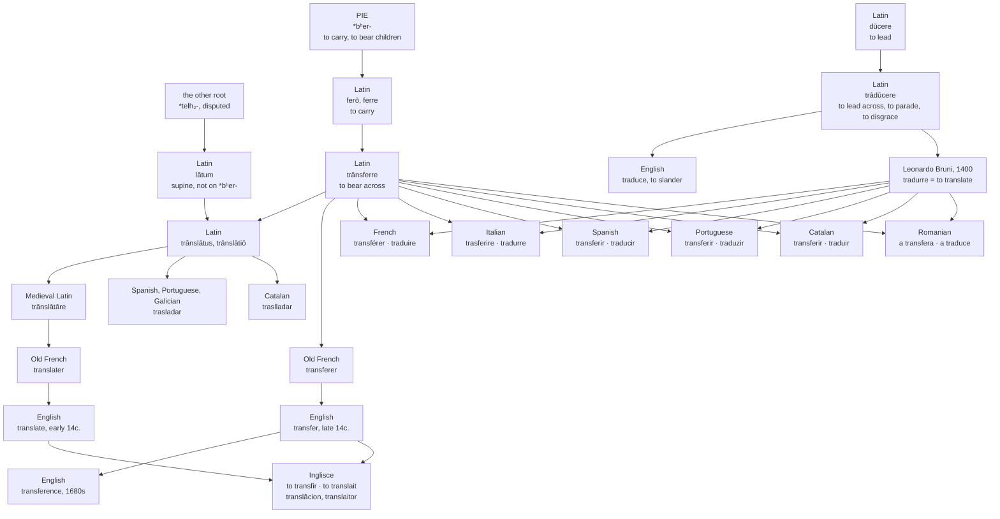

# *Transferre*: carried across two roots

A study of a verb meaning "to carry across" whose own paradigm is carried across two unrelated roots, of the two words every language got out of it without noticing, and of the third verb that took the job from both.

---

## 1. Across, and carry

Latin **trānsferre** is *trāns*, "across, beyond," plus *ferre*, "to carry." To bear across, to carry over, to bring through.

*Ferre* is the great suppletive verb of Latin, and its four principal parts come from two roots that have nothing to do with each other. *Ferō* and *ferre* are on *\*bʰer-*, "to carry," the root that also gives English *bear*. The perfect and supine, *tulī* and *lātum*, come from elsewhere — on the usual account from *\*telh₂-*, "to lift, to bear a weight," the root behind *tollere* and *tolerāre*, though de Vaan's judgement is that no good etymology for *lātus* is available. What is not in doubt is that they are not from *\*bʰer-*.

So *trānsferre* has a past participle, **trānslātus**, that shares nothing with its present stem but the prefix. Any word built on the one will look nothing like a word built on the other.

**Transfer** is the present stem. **Translate** is the supine.

They are the same Latin verb, and no English speaker connects them. A translated document and a transferred employee are the same operation named from the two halves of one paradigm.

---

## 2. English takes both stems

**Translate** arrives first, early in the fourteenth century, through Old French *translater* and behind it Medieval Latin *translātāre* — a verb the Middle Ages built out of the participle because Latin had not supplied one. It meant to remove something from one place to another and also to turn one language into another. It displaced the native Old English *wending*.

**Transfer** follows late in the same century, from Old French *transferer* or directly from the Latin: to relocate, to convey from one person to another, to hand over, and also to copy from one thing to another. The sense "make over the possession or control of" is from the 1590s.

The word then went out into the world and multiplied. The decorative-arts sense — lifting a design off one surface and laying it on another — is on record by 1839, which gives the printed transfers of Victorian nurseries and eventually the sticker. From the possession sense come the bank transfer and the transfer of a footballer. From the relocation sense come the transfer printed on a bus ticket, the transferred employee, the hospital transfer. One verb, and every one of those is the same act: a thing set down somewhere other than where it was.

The noun follows the verb, and English marks the difference between them by stress: tranSFER the verb, TRANSfer the noun. Same letters, different weight — for as long as that lasts.

---

## 3. Every language got it twice

Latin handed each of its daughters the same broken paradigm, and each of them made two verbs out of it without noticing.

Spanish is the clearest case, because it kept both and uses both. **Transferir** is the present stem, taken from the books. **Trasladar** is the participle stem, from *trānslātus*, and it means to move, to relocate, to shift, to copy out. A Spanish speaker who *traslada* an office and one who *transfiere* funds are using the same Latin verb twice and would be surprised to hear it.

The Spanish etymologists state the pattern outright: from *transferre* two verbs came down, one off the *infectum* stem and one off the participle, and the same thing happened to *referre*, which yielded both *referir* and *relatar*. Portuguese has *trasladar* beside *transferir*, Galician the same, Catalan *traslladar*. French had *translater* and has largely let it go.

The abstract noun went furthest of all. **Trānslātiō** named a carrying-across of any kind, and the medieval schoolmen applied it to history itself: **translātiō studiī**, the westward movement of learning from Athens to Rome to Paris, and **translātiō imperiī**, the same movement of political power, both traced to the second chapter of Daniel. There is a pessimist's version on record too — *translātiō stultitiae*, the transfer of stupidity, following behind as night follows the light westward, which is the figure behind the fourth book of Pope's *Dunciad*.

---

## 4. A letter of 1400

Then a third verb took the job, and it took it by mistake.

Latin **trādūcere** is *trāns* plus *dūcere*: to lead across. It also meant to lead someone across in a parade, to display them, and from there to disgrace and dishonour them. In classical use it never meant to translate.

On the fifth of September 1400, Leonardo Bruni wrote a letter turning on a phrase in Aulus Gellius: *vocabulum Graecum vetus traductum in linguam Romanam* — an old Greek word *brought over* into Latin. Bruni read *traductum* as though it meant *translated*, and began using *tradurre* in that sense deliberately and often in his prefaces. From Florence the usage spread across the peninsula and then out of it.

It swept the field. French **traduire**, Italian **tradurre**, Spanish **traducir**, Portuguese **traduzir**, Catalan **traduir**, Romanian **a traduce** — all of them, and Spanish *traducir* is a calque on the Florentine word rather than an independent development. Medieval Latin's *translatare*, which had served the whole of Europe for centuries, was left behind everywhere except in English, where it survives as the ordinary word for the thing.

French shows the changeover in progress, having carried both for a while: *translater* holding the physical senses of moving something, *traduire* arriving in the fifteenth century and confined at first to the law, where a man is still *traduit en justice*, brought before a court.

And English kept *trādūcere* as well — in the Roman sense Bruni had walked past. To **traduce** somebody is to lead them out in public and shame them. The verb that means *translate* in Madrid means *slander* in London, and the two are one word.

---

## 5. The comparative set

| Language | From the present stem | From the participle | To translate a text |
| :--- | :--- | :--- | :--- |
| **Inglisce** | to transfir | to translait | to translait |
| English | to transfer | translate | translate |
| French | transférer | translater, archaic | traduire |
| Italian | trasferire | — | tradurre |
| Spanish | transferir | trasladar | traducir |
| Portuguese | transferir | trasladar | traduzir |
| Catalan | transferir | traslladar | traduir |
| Romanian | a transfera | — | a traduce |

Three columns and three different stories. The present-stem verb was taken from the books by everybody and fitted to whichever conjugation was locally productive, French and Romanian to the first and the rest to the fourth, with nothing in the Latin to decide it.

The participle verb survives unevenly, and where it survives it holds the physical sense — moving house, shifting an office, carrying a body — while the learned verb took the abstract and the financial.

The last column is the one that does not line up. Every Romance language uses a verb from outside the family, and only English and Inglisce translate with a word that actually means *carried across*. English is not being conservative by intention here. It simply took *translate* from Medieval Latin in the fourteenth century and was insulated from a fashion that started in Florence a hundred years later, so it kept the older European word by not being on the continent when the word changed.

---

## 6. The Inglisce forms

**to transfir** · transfre, transfres, transfred, transfiring
**transfre**, transfirs
**transfêrable**, **transfêrence**, **transfêral** · **transferencial**
**to translait** · **translâcion** · **translaitor**

English held the verb and the noun apart by stress alone — tranSFER against TRANSfer — and in much of American speech the noun's initial stress has now taken the verb as well, leaving the difference marked nowhere at all. Here it is marked in the letters: the infinitive **transfir** against the noun **transfre**. The present tense still coincides with the noun, as it does in English, but the citation forms no longer do.

The verb keeps its Romance shape while everything built on it takes the Latin, which is why the derivatives return the full *-fer-*. The circumflex then marks a stressed r-coloured vowel and appears only where that syllable takes the weight: not in *transfir* or *transfre*, where the stress sits on *trans-*; present in *transfêrable*, *transfêrence* and *transfêral*; gone again in *transferencial*, where the weight moves past it onto *-en-*.

It releases the consonant too. English doubles inconsistently in this family, wavering between *transferable* and *transferrable*, because the doubled letter is its only way to signal a stressed short vowel. Once the mark says that, the *r* is spent once and there is nothing left to waver about.

That the two halves of one Latin verb come out as **transfir** and **translait**, sharing not a letter after *tran-*, is not a defect of the spelling. The words have shared nothing since Latin, and an orthography that made them look alike would be inventing a kinship the language does not have.
