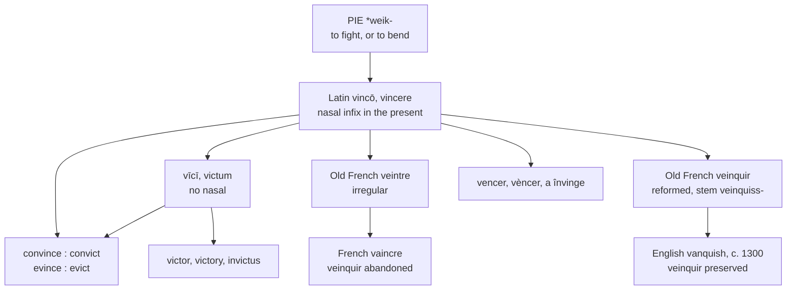

# *Vincere*: the *n* that comes and goes

A study of a Latin verb with a consonant in half its paradigm, of two pairs of English words that are each one verb split down that seam, and of a French verb that died in France and survived in England.

---

## 1. The root

Latin *vincō, vincere, vīcī, victum* means "to conquer, to overcome, to prevail."

The *n* is present in the first two forms and absent from the last two, and that is not erosion but formation. Latin built certain present stems with a **nasal infix** — a consonant inserted into the root, present in the present system and nowhere else. The pattern recurs across the language:

| Present | Perfect | Supine |
|---|---|---|
| *vincō* | *vīcī* | *victum* |
| *rumpō* | *rūpī* | *ruptum* |
| *findō* | *fidī* | *fissum* |
| *frangō* | *frēgī* | *frāctum* |
| *tangō* | *tetigī* | *tāctum* |

So *vincere* and *victum* are one verb, and the *n* marks which half of it a given form belongs to.

The Proto-Indo-European root is disputed. Watkins derives it from \**weik-* "to fight, to conquer," and points to Old Irish *fichim* "I fight," Old Norse *vígr* "able in battle," and the Celtic tribal name *Ordovices*, "those who fight with hammers" — which is where the geological *Ordovician* comes from. De Vaan prefers a different \**weik-* meaning "to bend, to tie," observing that bending develops easily into conquering, one party bending the other, or into yielding, the other being bent.

---

## 2. Two doublets on one seam

Because English borrowed from both halves of the paradigm, it holds two pairs of words that are each a single Latin verb.

| Present stem *vinc-* | Participial stem *vict-* | One Latin verb |
|---|---|---|
| **convince** | **convict** | *convincere* |
| **evince** | **evict** | *ēvincere* |

**Convince** and **convict** are *convincere*, "to overcome thoroughly." To convince a person is to overcome their doubt; to convict them is to have overcome their denial in court. English took the first from the present stem and the second from the participle, and now uses one in argument and the other in law.

**Evince** and **evict** are *ēvincere*, "to overcome and so drive out." To evince a quality is to bring it out where it can be seen; to evict a tenant is to drive them out of a house. Same verb, same two stems, and no speaker connects them.

The rest of the family divides the same way:

| From *vinc-* | From *vict-* |
|---|---|
| **vanquish**, **invincible**, **vincible**, **Vincent** | **victor**, **victory**, **victorious**, **invictus** |

---

## 3. The verb France lost

Latin *vincere* gave Old French *veintre*, which was irregular and difficult, and beside it a reformed second-group verb *veinquir*, *vainquir*, with the extended stem *veinquiss-*.

Middle English borrowed the reformed one, as *venquisshen*, *vencuschen*, *vaynquisshen*, about 1300.

French then went the other way. *Veinquir* died out, and modern French continues *veintre* as **vaincre** — still irregular, with *je vaincs* against *nous vainquons*. The tidy verb was abandoned in France and preserved in England.

Two things follow. First, English *vanquish* has a `-ish` that is historically earned: it is the French *-iss-* stem of a real second-group verb, not an ending attached by analogy as it was in several other English verbs of this shape.

Second, **English changed the vowel and nobody else did.** The Middle English forms have *e* — *venquisshen*, *vencuschen* — as do Spanish, Portuguese, and Catalan *vencer*. The *a* of modern *vanquish* is a late English alteration with no counterpart anywhere in the family.

---

## 4. The comparative sets

### The verb

| | To conquer | First person | The stem |
|---|---|---|---|
| **Latin** | *vincere* | *vincō* | *vinc-* |
| **French** | *vaincre* | *je vaincs* | *vainqu-* |
| **Italian** | *vincere* | *io vinco* | *vinc-* |
| **Spanish** | *vencer* | *yo venzo* | *venc-* |
| **Portuguese** | *vencer* | *eu venço* | *venc-* |
| **Catalan** | *vèncer* | *jo venço* | *venc-* |
| **Romanian** | *a învinge* | *eu înving* | *înving-* |
| **English** | *to vanquish* | *I vanquish* | *vanquish-* |
| **Inglisce** | *to vencoișe* | *I vencoișe* | *vencoiș-* |

Latin *vincere* is third conjugation. Italian kept it there unchanged. Iberian Romance moved it to the *-er* class and lowered the short *i* to *e*, which is the regular outcome. Romanian prefixed it with *în-*. Only French rebuilt the paradigm around a stem in *-qu-*, and only English then borrowed that stem.

### The victory

| | Victory | Invincible |
|---|---|---|
| **Latin** | *victōria* | *invincibilis* |
| **French** | *la victoire* | *invincible* |
| **Italian** | *la vittoria* | *invincibile* |
| **Spanish** | *la victoria* | *invencible* |
| **Portuguese** | *a vitória* | *invencível* |
| **Catalan** | *la victòria* | *invencible* |
| **English** | *the victory* | *invincible* |
| **Inglisce** | *þa victorie* | *invinçable* |

The second column divides the languages. French, Italian, and English take *invincible* straight from the Latin, keeping the Latin *i*. Spanish, Portuguese, and Catalan rebuilt the adjective on their own verb — *vencer* gives *invencible* and *invencível* — so that in Iberian Romance the adjective and the verb still visibly belong together, and in the other three they do not.

Inglisce takes the Iberian side, `invinçable` standing beside `vencoișe` as *invencible* stands beside *vencer*.

---

## 5. The Inglisce forms

### The *vinc-* verbs

| English | Inglisce |
|---|---|
| vanquish, vanquished, vanquishing | `vencoișe`, `vencoișed`, `vencoișing` |
| vanquisher | `vencoișor` |
| vanquishment | `vencoișement` |
| convince, convinced, convincing | `convince`, `convinced`, `convincing` |
| unconvincing | `unconvincing` |
| evince | `evince` |

**`Vencoișe` restores the vowel** discussed above, putting the verb back beside *vencer* and beside its own Middle English forms.

**`Coi` writes /kwɪ/.** The `c` has its hard value before a back vowel, the `o` writes the labial glide, and the `i` the vowel that follows. English uses `qu`, a digraph whose *u* is silent across most of the Latinate vocabulary — *conquer*, *quay*, *mosquito* — and sounded elsewhere, with nothing to say which.

**`Ș` writes a suffix that is genuinely there.** *Vanquish* really does end in the French *-iss-* stem, taken from a second-group verb that existed and was conjugated. English `sh` is the native digraph of *ship* and *fish*, and puts a Romance verb in Germanic clothing.

**`Convince` and `evince` are untouched.** The `c` stands before a front vowel and has its soft value by the ordinary rule, so English has already spelled them correctly.

**`Vencoișor` and `vencoișement`** take the Latin agentive `-or` and the French `-ement`, where English writes `-er` and `-ment`. Spanish and Portuguese have the same noun in *vencimiento* and *vencimento*.

### The *-able* suffix

| English | Inglisce |
|---|---|
| invincible | `invinçable` |
| invincibility | `invinçabilitie` |
| vincible | `vinçable` |

**English splits this suffix and Inglisce does not.** *-able* and *-ible* are both /əbəl/ and differ only in ancestry: *-ābilis* attached to Latin first-conjugation verbs and *-ibilis* to the rest. The distinction was never audible, and English has spent centuries producing doublets — *defensible* beside *defendable*, *collectible* beside *collectable* — because no speaker can hear which is wanted. Inglisce writes `-able` throughout.

**The cedilla follows from that choice.** With `a` after the `c`, the letter would take its hard value and give /k/, so the cedilla is required to keep it soft: `invinçable`. Where English's `i` did the conditioning invisibly, the diacritic does it in the open.

### The *vict-* words

| English | Inglisce | Plural |
|---|---|---|
| victor | `victre` | `victors` |
| victory | `victorie` | `victoris` |
| victorious, victoriously | `victorieus`, `victorieusly` | — |

**`Victre` and `victors` transpose the letters** around the syllabic *r*, writing `-re` where the word ends and `-or-` where a suffix follows. The vowel is the same in both, and the Latin *victor* is visible in the second.

**`Victorieus` writes `-ieus` for /iəs/.** English spells that one sound two ways — `-ious` in *various* and *curious*, `-eous` in *hideous* and *courteous* — and uses the similar-looking `-ous` for something else entirely, the /əs/ of *famous* and *nervous*.

### Noun against verb

This is the set's most consequential distinction.

| | The noun | The verb |
|---|---|---|
| **English** | *convict* /ˈkɑnvɪkt/ | *convict* /kənˈvɪkt/ |
| **Inglisce** | `convict` | `convicte` |
| **English** | — | *to evict* |
| **Inglisce** | — | `evicte` |

English writes one spelling for two words and distinguishes them only by stress, which it does not mark. *A convict* and *to convict* differ in where the accent falls and in nothing else on the page.

The pattern runs through the language — *a rebel* and *to rebel*, *a record* and *to record*, *a permit* and *to permit*, *an object* and *to object*, *a subject* and *to subject*, *a contract* and *to contract*. The silent `-e` marks the verb and the bare form is the noun.

The paradigms are `convicte`, `convics`, `convicted`, `convicting`, and `evicte`, `evics`, `evicted`, `evicting`.

**`Convics` writes a cluster English spells and commonly does not say.** The sequence /kts/ simplifies to /ks/ in ordinary speech, so *convicts* and *evicts* are usually /ˈkɑnvɪks/ and /ɪˈvɪks/. The spelling follows the mouth rather than the morphology.

### The doubled *c*

| English | Inglisce |
|---|---|
| conviction | `conviccion` |
| eviction | `eviccion` |

A single `c` before `-ion` gives /ʃ/; the doubling holds the velar that the single letter would lose, so `cc` writes /kʃ/. The spelling records the Latin *ct* cluster of *convictum* while stating the sound, and keeps `convicte` and `conviccion` visibly the same word.

### Left as they are

`Province`, `provincial`, and `invictus` are unchanged. The first two are spelled correctly already, the `c` standing before a front vowel; and their derivation from this root, though traditional, is not secure. `Invictus` is Latin and stays Latin.
