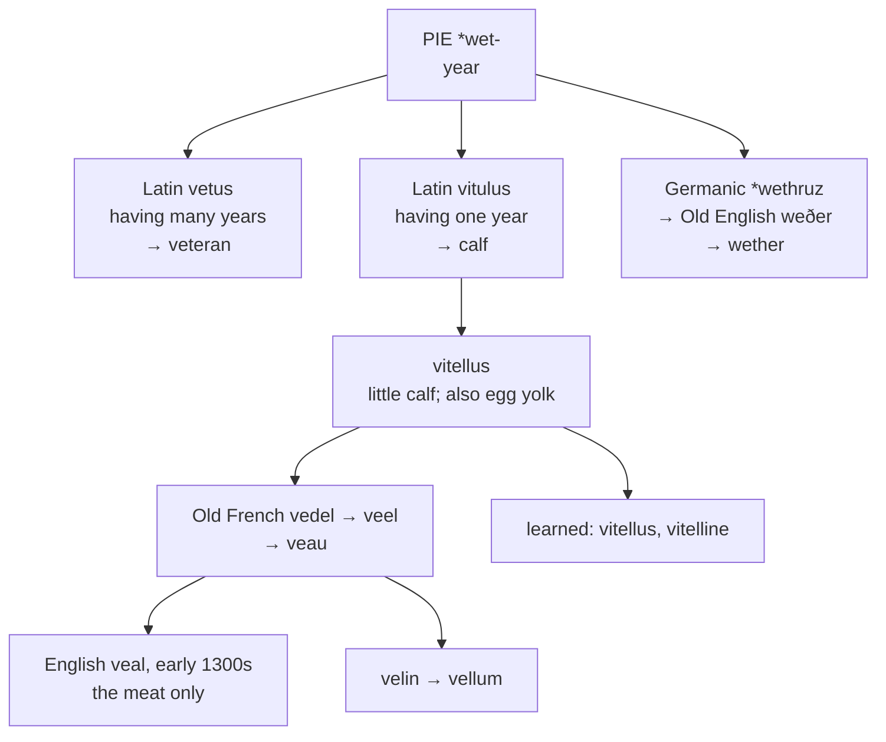

# *Vitellus*: a yearling, and a veteran

A study of a word that once meant nothing but *one year old*, of the root it shares with the oldest soldier in the army, and of an English distinction between an animal and its meat that no other language makes.

---

## 1. The root

Proto-Indo-European **\*wet-** means "year." It is a small root with a long reach.

| Language | Word | Sense |
|---|---|---|
| Greek | *étos* | year |
| Hittite | *witiš* | year |
| Sanskrit | *vatsa-* | year; and *vatsáh*, a calf |
| Old Church Slavonic | *vetŭchŭ* | old |
| Latin | *vetus*, *veteris* | old, aged |
| Latin | *vitulus* | calf |

The two Latin entries are the point. **Vetus** is "having many years," and gives English *veteran*, *inveterate*, and *veterinary*. **Vitulus** is "having one year" — a yearling — and gives English *veal*.

So the oldest soldier and the youngest cow are named by the same root, one for having accumulated years and the other for having exactly one.

The Germanic branch confirms the sense. Gothic *wiþrus* "lamb" and Old English *weðer* "ram" both descend from \**wet-* and both mean, at bottom, *yearling*. English still has the word as **wether**, a castrated ram — surviving mainly in *bellwether*, the leading sheep with the bell on it.

---

## 2. The diminutive

Latin made *vitulus* smaller. **Vitellus** is "little calf," with the *-ellus* suffix that also gives *castellum*, *agnellus*, and *martellus*.

The diminutive is what Romance inherited, not the simplex, and its outcomes are the ordinary ones for *-ellus*: Italian *-ello*, French *-eau* through *-el*, Portuguese and Catalan *-elo* and *-ell*.

*Vitellus* had a second sense in Latin that has nothing obvious to do with cattle: **the yolk of an egg**. English has that too, as the anatomical *vitellus* and the adjective *vitelline*, used of the yolk sac and the membrane around it. So *veal* and *vitelline* are a doublet — one through French speech in the fourteenth century, one from the Latin page for the use of embryologists.

A third descendant is **vellum**, from Old French *velin*, "parchment of calfskin," built on *vel* "calf." Spanish kept the Latin form for exactly this sense: *vitela* in Spanish is not veal but vellum.

---

## 3. The animal and the meat

English is alone in the set in using this word for **the meat only**.

*Veal* is what is eaten; the animal is a *calf*, from Old English *cealf*. Every other language uses one word for both, or distinguishes them only by gender: Italian *vitello*, Romanian *vițel*, Catalan *vedell*, Portuguese *vitelo* against *vitela*.

The split is the familiar Norman one. After 1066 the animals in the field kept their English names and the dishes on the table took French ones, so that English holds a matched set no neighbouring language possesses:

| The animal | The meat |
|---|---|
| calf (*cealf*) | veal (*veel*) |
| ox, cow (*oxa*, *cū*) | beef (*boef*) |
| sheep (*scēap*) | mutton (*moton*) |
| pig, swine (*picg*, *swīn*) | pork (*porc*) |
| deer (*dēor*) | venison (*venesoun*) |

The pattern is often said to reflect who raised the animals and who ate them. Whatever its cause, it left English with two vocabularies where one would do, and *veal* is the member of the set whose French original meant the animal and not the dish.

---

## 4. The comparative set

| | The word | What it names |
|---|---|---|
| **Latin** | *vitellus* | a little calf; an egg yolk |
| **French** | *le veau* | the animal and the meat |
| **Italian** | *il vitello* | the animal and the meat |
| **Portuguese** | *a vitela* | the meat; *o vitelo*, the animal |
| **Catalan** | *el vedell* | the animal and the meat |
| **Romanian** | *vițelul* | the animal |
| **Spanish** | *la vitela* | vellum, not veal |
| **English** | *the veal* | the meat only |
| **Inglisce** | *þe viele* | the meat only |

**Spanish left the family.** Its word for veal is *ternera*, from *tener* "tender" — the meat named for its texture rather than the animal's age — and *ternero* is the calf. *Vitela* survives in Spanish only in the parchment sense.

**Catalan preserves an intermediate stage.** *Vedell* keeps the *d* that Old French had in *vedel* and then lost on the way to *veel* and *veau*. Reading across the row from *vitellus* to *vedell* to *veel* to *veau*, the consonant weakens and disappears in three steps.

---

## 5. The Inglisce form

**`Viele` restores the Latin vowel.** *Vitellus*, *vitello*, *vitela*, *vițel*, and *vedell* all show an *i* in the first syllable. French lost it in the passage *vedel* → *veel* → *veau*, and English inherited the loss, writing *ea* for a vowel that has nothing to do with either letter.

The `ie` states the /i/ and puts the word back beside its cognates. What English writes as `ea` here it also uses for /ɛ/ in *head* and *bread*, /eɪ/ in *great* and *steak*, and /ɪə/ in *idea* — four values for one digraph, distributed by no rule a reader can apply.

**The silent `-e` is the ordinary marking of a monosyllabic noun**, and `viele` is /vil/ throughout.

The article is masculine, `þe`.
