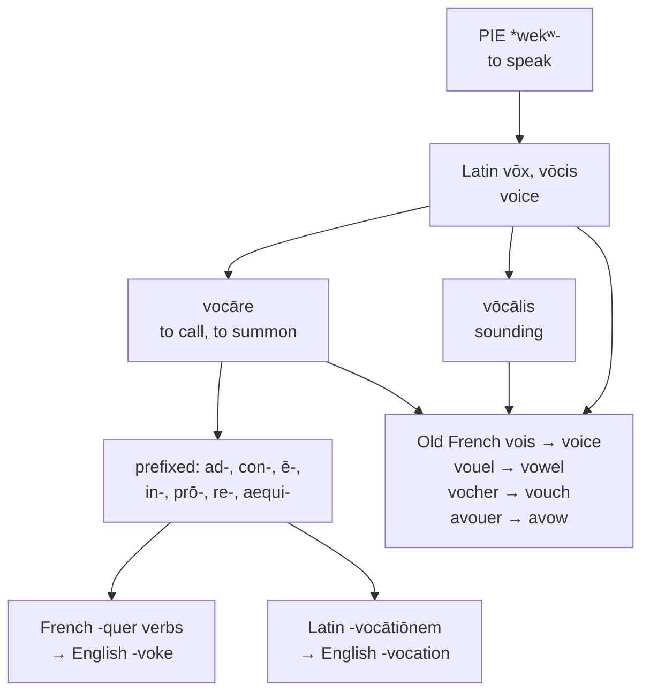

# *Vōx*: forty words for calling out

A study of one of the largest families English holds from a single Latin root, of four common words that are two words twice over, and of a spelling convention that leaves a noun and a verb indistinguishable on the page.

---

## 1. The root

Latin *vōx*, genitive *vōcis*, means "voice, sound, utterance, word." It descends from Proto-Indo-European **\*wekʷ-** "to speak," through a nominal \**wṓkʷs*.

The root is widely attested. Sanskrit has *vāk*, *vācas* "speech" — the goddess Vāc is speech personified. Avestan has *vāxš*. Greek has *óps* "voice" and, in a different formation, *épos* "word, song," which gives English **epic** and **orthoepy**.

From *vōx* Latin formed the denominative verb **vocāre** "to call, to summon, to name," and it is *vocāre* rather than *vōx* that generated most of the family. The distinction matters: some English words descend from the noun and are about sound, while others descend from the verb and are about summoning.

---

## 2. Four words that are two

Two pairs in this family are worth isolating, because in each the connection has been entirely lost.

**Avow is advocate.** Old French *avouer* comes from Latin *advocāre*, "to call to one's side" — the act of summoning someone as a witness or backer. English took the French verb around 1300 as *avow*, and took the Latin participle *advocātus* separately as *advocate*. To avow something is to call it to your side, exactly as an advocate is one called to yours.

**Vouch is vocation.** Old French *vocher* is Latin *vocāre* directly, and it entered English meaning "to call as a witness." *Vocation* is *vocātiōnem*, a calling — the same verb, borrowed from the page rather than from speech, and applied to the summons a person feels toward a trade.

So *avow*, *advocate*, *vouch*, and *vocation* are four English words from one Latin verb, taken in two pairs, and no speaker connects any of them.

---

## 3. Calling in every direction

Latin prefixed *vocāre* freely, and English took the whole set:

| Latin | Literally | English |
|---|---|---|
| *ad-vocāre* | to call toward | **advocate**, **avow** |
| *con-vocāre* | to call together | **convoke**, **convocation** |
| *ē-vocāre* | to call out | **evoke**, **evocative** |
| *in-vocāre* | to call upon | **invoke**, **invocation** |
| *prō-vocāre* | to call forth | **provoke**, **provocation** |
| *re-vocāre* | to call back | **revoke**, **irrevocable** |
| *aequi-vocāre* | to call equally | **equivocate**, **equivocal** |

**Equivocal** repays a moment. *Aequus* is "equal" and *vōx* is "voice," so an equivocal statement is one in which two meanings have equal voice — neither louder than the other. To equivocate is to speak so that both remain audible.

Two English words deny it from different directions. *Unequivocal* negates the compound: not open to two readings. *Univocal* replaces the first element: *ūnus*, one voice, a term of scholastic logic for a word bearing a single sense.

**Vociferous** is *vōx* plus *ferre* "to carry": voice-carrying.

**Avocation** is not a variant of *vocation* but its opposite in form. The prefix is *ab-* "away," so an *avocātiō* is a calling away — a distraction from one's proper business, and thence the minor pursuit a person keeps beside the main one. *Vocation* calls toward and *avocation* calls away.

---

## 4. Where the verbs and the nouns came from

Every one of the prefixed verbs shows the same split, on the pattern of *conquer* beside *conquest*: a verb out of French and a noun out of Latin.

The **verbs** came from French: *provoquer*, *révoquer*, *convoquer*, *invoquer*, *évoquer*, which English reduced to *-voke*.

The **nouns** came from Latin: *prōvocātiōnem*, *revocātiōnem*, *convocātiōnem*, and the rest, which English kept as *-vocation*.

So English writes *provoke* and *provocation* with different vowels and different consonants, and the relation has to be learned rather than seen. French keeps *provoquer* and *provocation* visibly together; Spanish and Italian more so still, with *provocar* and *provocación*, *provocare* and *provocazione*.

---

## 5. The comparative sets

### The voice and the vowel

| | The voice | The vowel | Vocal |
|---|---|---|---|
| **Latin** | *vōx*, *vōcem* | *vōcālis* | *vōcālis* |
| **French** | *la voix* | *la voyelle* | *vocal* |
| **Spanish** | *la voz* | *la vocal* | *vocal* |
| **Portuguese** | *a voz* | *a vogal* | *vocal* |
| **Italian** | *la voce* | *la vocale* | *vocale* |
| **Catalan** | *la veu* | *la vocal* | *vocal* |
| **English** | *the voice* | *the vowel* | *vocal* |
| **Inglisce** | *þe voice* | *þe vôale* | *vocal* |

Only French and English lost the consonant of *vōcālis*, and only they therefore have a word for *vowel* that does not look like *vocal*. Portuguese voiced it to *vogal*; Spanish, Catalan, and Italian kept it outright and use one word for both the letter and the adjective.

### The advocate

| | The advocate | The verb | Its sense |
|---|---|---|---|
| **Latin** | *advocātus* | *advocāre* | to call to one's side |
| **French** | *l'avocat* | *avouer* | to confess, to admit |
| **Spanish** | *el abogado* | *abogar* | to plead for |
| **Portuguese** | *o advogado* | *advogar* | to plead for |
| **Italian** | *l'avvocato* | *avvocare* | to plead for (rare) |
| **Catalan** | *l'advocat* | *advocar* | to plead for |
| **English** | *the advocate* | *to avow* | to declare openly |
| **Inglisce** | *þe advocat* | *to avôe* | to declare openly |

Spanish *abogado* and *abogar* are the word worn down by ordinary speech — *ad-* to *ab-*, and the *c* voiced to *g*. Portuguese and Catalan restored the *d* from the Latin.

The verb's sense is where the languages part. Iberian Romance kept it close to the Latin: to *abogar* is to plead on someone's behalf, which is what an advocate does. French and English took the reflexive turn instead — to call something to one's own side is to own it, and so *avouer* means to confess and *avow* means to declare openly. The advocate pleads for another; the avower pleads for himself.

### The prefixed verbs

| | Convoke | Provoke | Revoke | Provocation |
|---|---|---|---|---|
| **Latin** | *convocāre* | *prōvocāre* | *revocāre* | *prōvocātiōnem* |
| **French** | *convoquer* | *provoquer* | *révoquer* | *la provocation* |
| **Spanish** | *convocar* | *provocar* | *revocar* | *la provocación* |
| **Portuguese** | *convocar* | *provocar* | *revogar* | *a provocação* |
| **Italian** | *convocare* | *provocare* | *revocare* | *la provocazione* |
| **Catalan** | *convocar* | *provocar* | *revocar* | *la provocació* |
| **English** | *to convoke* | *to provoke* | *to revoke* | *the provocation* |
| **Inglisce** | *to convoque* | *to provoque* | *to revoque* | *þa provocâcion* |

Portuguese *revogar* voiced the consonant as it did in *vogal*, and so has a verb that no longer matches its own noun *revogação*. Every other language keeps the stem intact.

---

## 6. The Inglisce forms

### The voice group

| English | Inglisce |
|---|---|
| voice, voices, voiced, voicing | `voice`, `voices`, `voiced`, `voicing` |
| voiceless | `voiceless` |
| vowel | `vôale`, `vôals` |

**`Voice` is left untouched.** The spelling came through Old French *vois* and already states the sound; nothing in it misleads.

**`Vôale` writes the diphthong and the reduced vowel separately.** English *vowel* is /ˈvaʊəl/: a diphthong, then a schwa, then /l/. `Ô` gives the diphthong and `a` the schwa, one letter apiece. English uses `ow` for the first and `e` for the second, and `ow` is also its spelling for /oʊ/ in *low* and *grow*, so the reader must know the word to read it.

### The vocal group

| English | Inglisce |
|---|---|
| vocal, vocalic, vocalist | `vocal`, `vocalic`, `vocalist` |
| vocalize, vocalization | `vocalyse`, `vocalisâcion` |
| vocative | `voccatif` |
| vociferous, vociferate, vociferation | `vocifferus`, `vocifferait`, `vocifferâcion` |
| vocable, vocabulary | `vocable`, `vocàbularie`, `vocàbularis` |
| vocation, vocational, avocation | `vocâcion`, `vocâcional`, `avocâcion` |

**Doubled consonants mark the preceding vowel short.** `Voccatif` has /ɑ/ where a single `c` would leave the `o` free to read as /oʊ/, and `vocifferus` and `vocifferait` double the `f` for the same reason. The convention is English already — *hopping* against *hoping* — applied where English declines to apply it.

**`Vocalyse` and `vocalisâcion` record a vowel English changes and does not write.** *Vocalize* is /aɪ/ and *vocalization* is /ɪ/; `y` and `i` state the difference. The single `s` between vowels is /z/ in both.

**`Vocàbularie`** takes the grave for /æ/, the vowel being neither the /eɪ/ of an open syllable nor a reduced one.

### The calling group

| English | Inglisce |
|---|---|
| vouch, voucher | `voac̃e`, `voac̃er` |
| vouchsafe | `to voac̃e saif` |
| avouch | `avoac̃e` |
| avow, avowed, avowal, disavow | `avôe`, `avôed`, `avôale`, `disavôe` |

**`C̃` writes the affricate that Latin *c* became.** *Vouch* descends from *vocāre* through Old French *vocher*, where the *c* palatalised; the tilde records the letter and its outcome together, so `voac̃e` shows the *voc-* that `vocâcion` and `vocal` also show. English `ch` conceals it.

The digraph `oa` is /oʊ/ in most environments, but the sequence `oac̃e` is always /aʊ/, so `voac̃e` and `avoac̃e` read without ambiguity.

**`To voac̃e saif` stays two words.** English fused *vouch safe* into a single verb in the fourteenth century and has spelled it solid ever since, with the result that neither element is legible: nothing in *vouchsafe* shows the *voc-* of *vocation* or the *safe* of ordinary use. Inglisce leaves the phrase open — a verb governing an adjective, which is what it is — so that to vouchsafe something is visibly to vouch it safe, to warrant it as secure. The construction is the same as English *to make ready* or *to set free*, and English's own earliest attestations write the two words apart.

**`Avôe` has no consonant to record**, the *c* of *advocāre* having vanished entirely on the way through *avouer*. Where the consonant survived, the spelling keeps it; where it did not, the vowel stands alone.

**A genuine coincidence.** `Avôale` is *avowal*, and `a vôale` is *a vowel*. In English the near-identity of the two is a pun; here it is closer, and it is also true — *avowal* is *advocāre* and *vowel* is *vōcālis*, both from *vōx*. The two words are genuinely cousins, which is more than can be said for *vow* and *vowel*.

### The prefixed verbs

| English | Inglisce |
|---|---|
| convoke, convocation | `convoque`, `convoac`, `convoqued`, `convoquing`; `convocâcion` |
| evoke, evocation, evocative | `evoque`, `evoac`, `evoqued`, `evoquing`; `evocâcion`, `evoccatif` |
| invoke, invocation | `invoque`, `invoac`, `invoqued`, `invoquing`; `invocâcion` |
| provoke, provocation, provocative | `provoque`, `provoac`, `provoqued`, `provoquing`; `provocâcion`, `provoccatif` |
| revoke, revocation, irrevocable | `revoque`, `revoac`, `revoqued`, `revoquing`; `revocâcion`, `irrevócable` |
| provocateur | `provocateur` |

**`Qu` requires a following vowel letter, and the paradigm works around it.** The infinitive, the past, and the progressive all supply one — `convoque`, `convoqued`, `convoquing` — so the French spelling stands. The bare present does not, and there the stem is written `convoac`, with `oa` carrying the same /oʊ/ that `o…e` carries elsewhere.

| | Form | Spelling of /oʊk/ |
|---|---|---|
| infinitive | `convoque` | `oqu` + silent `e` |
| present | `convoac`, `convoacs` | `oac` |
| past | `convoqued` | `oqu` + `e` |
| progressive | `convoquing` | `oqu` + `i` |

The alternation is orthographic rather than grammatical: it follows from what the digraph permits, not from anything about tense.

**`-que` restores the French spelling** that English reduced to `-ke`, so `convoque`, `provoque`, and `revoque` stand beside *convoquer*, *provoquer*, and *révoquer*.

**`Provoccatif` and `evoccatif`** double the `c` to keep the preceding vowel short, as `voccatif` does.

### The noun and the verb told apart

This is the set's most consequential distinction.

| | Noun or adjective | Verb |
|---|---|---|
| **English** | *advocate* /ət/ | *advocate* /eɪt/ |
| **Inglisce** | `advocat` | `advocait` |

English writes one spelling for two words. *An advocate* and *to advocate* differ in their final vowel — /ət/ against /eɪt/ — and in nothing else, and the language leaves the reader to work out which is meant from the syntax.

The pattern is not isolated. *Delegate*, *estimate*, *separate*, *moderate*, *associate*, *graduate*, *duplicate*, *alternate*, *deliberate*, and dozens more behave identically. Inglisce writes `-at` for the noun and `-ait` for the verb, and the ambiguity disappears.

The *equivocal* set has three members where English has two:

| | Adjective | Noun or adjective | Verb |
|---|---|---|---|
| **Latin** | *aequivocus* | *aequivocus* | *aequivocāre* |
| **Spanish** | *equívoco* | *el equívoco* | *equivocar* |
| **English** | *equivocal* | — | *to equivocate* |
| **Inglisce** | `eqüivocal` | `eqüivocat` | `eqüivocait` |

Spanish *el equívoco* is a misunderstanding or an ambiguity — the thing itself, not the quality of it. English has no ordinary noun there and must say *an ambiguity* or fall back on the rare *equivoque*.

### The diaeresis

| English | Inglisce |
|---|---|
| equivocal, equivocate | `eqüivocal`, `eqüivocait` |
| equivocation | `eqüivocâcion` |
| unequivocal, univocal | `uneqüivocal`, `univócal` |

**`Ü` marks the `u` of `qu` as pronounced.** Elsewhere in this family `qu` is /k/ with the `u` silent — `convoque`, `revoqued` — so a word in which the `u` is heard needs saying so. The convention is Spanish and Catalan, which write *pingüino* and *qüestió* for exactly this reason.

`Univócal` has no `qu` and needs no diaeresis; the acute marks its stressed `o`.

`Irrevócable` settles a word English cannot. The received pronunciation stresses the second syllable, /ɪˈrɛvəkəbəl/, and reduces the third; a widely used variant stresses the third instead, /ˌɪrɪˈvoʊkəbəl/, and gives it a full /oʊ/. English writes one spelling and lets speakers choose. The acute picks the second reading and states it.
