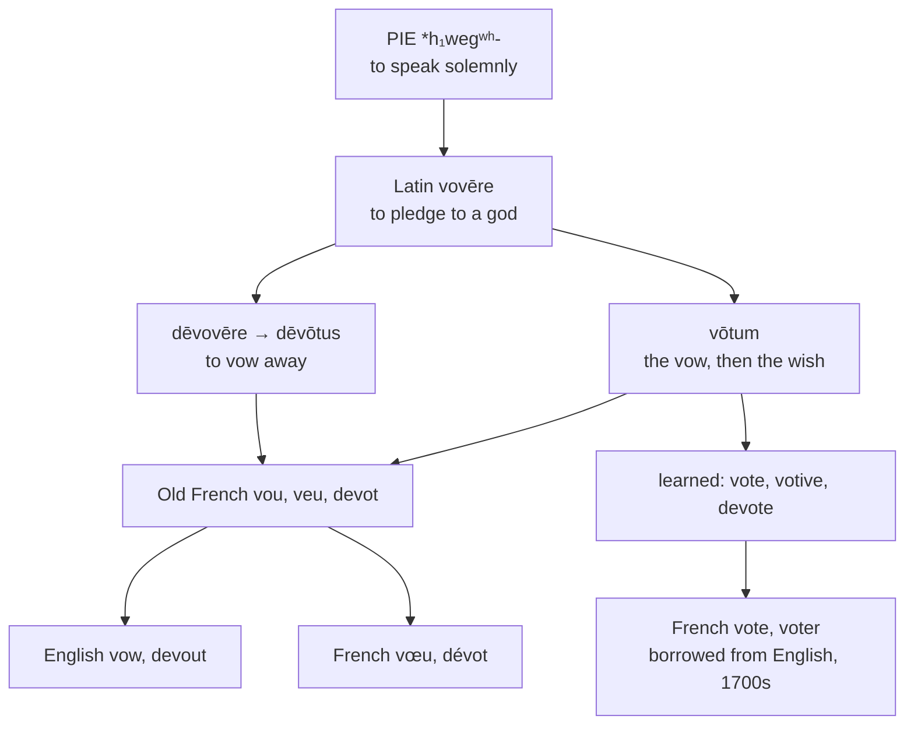

# *Vovēre*: what was promised to a god

A study of a Roman religious formula that became a ballot, of a general who vowed his own death, and of two pairs of English words that are each the same word twice.

---

## 1. The root

Latin *voveō, vovēre, vōvī, vōtum* means "to vow, to pledge, to promise solemnly to a god." It descends from Proto-Indo-European **\*h₁wegʷʰ-** "to speak solemnly," a root attested in Greek *eúkhomai* "to pray, to vow, to boast," Sanskrit *óhate*, and Avestan *aog-*.

The root is about a particular kind of speech: not conversation, not naming, but the utterance that binds the speaker. Every descendant carries that force, which is why the family runs to *vow*, *devotion*, and *votive* rather than to anything about talking.

---

## 2. The Roman vow

A *vōtum* was a contract with a deity, and it had a fixed shape: *if you grant me this, I will render you that*. The vow was undertaken (*vōtum suscipere*), and when the god performed, the vow was discharged (*vōtum solvere*).

The formula survives in thousands of inscriptions, usually abbreviated **V·S·L·M** — *vōtum solvit libēns meritō*, "he discharged his vow willingly and deservedly." A stone cut with those four letters is a receipt.

The state made vows too. Consuls entering office pronounced *vōta pūblica* for the safety of the Republic, and later the *vōta* for the emperor's health were renewed at fixed intervals, marked on coinage as VOT V, VOT X, VOT XX.

**Devotio** was the extreme case. *Dēvovēre* is to vow *away* — to pledge something irrevocably — and in its most famous application a Roman commander vowed himself and the enemy army together to the gods of the underworld, then rode into the enemy line to die. Livy records Publius Decius Mus performing the rite at Vesuvius in 340 BC, and his son and grandson after him. The word English uses for pious feeling began as a technical term for a general's suicide.

---

## 3. From a wish to a ballot

*Vōtum* drifted from "a thing promised to a god" to "a thing wished for," and thence simply to a wish or desire. That is the sense French kept: *le vœu* is a wish as much as a vow, and *meilleurs vœux* on a New Year's card asks nothing of any deity.

From "wish" the step to "expressed preference in an assembly" is short, and English took it in the mid-fifteenth century, borrowing *vōtum* directly from Latin as **vote**.

Then something unusual happened. The political sense developed in Britain, and in the early eighteenth century French borrowed *vote* and *voter* **back from English** — a Latin word that went to England, learned parliamentary procedure, and returned to France as an anglicism. French already had *vœu* from the same *vōtum*, inherited without interruption, so modern French holds both the native descendant and the English round trip.

---

## 4. Two doublets

English took this family twice over, and both pairs survive.

| Popular, through French | Learned, from Latin | Latin source |
|---|---|---|
| **vow**, c. 1300 | **vote**, mid-1400s | *vōtum* |
| **devout**, c. 1200 | **devote**, 1580s | *dēvōtus* |

*Vow* and *vote* mean a promise and a preference. *Devout* and *devote* mean pious and dedicated. In each pair the French form arrived first and kept the emotional sense, and the Latin form arrived later and took the procedural one.

---

## 5. The comparative sets

### The vow and the vote

| | The vow | The ballot | Votive |
|---|---|---|---|
| **Latin** | *vōtum* | — | *vōtīvus* |
| **French** | *le vœu* | *le vote*, *voter* | *votif* |
| **Spanish** | *el voto* | *el voto*, *votar* | *votivo* |
| **Portuguese** | *o voto* | *o voto*, *votar* | *votivo* |
| **Italian** | *il voto* | *il voto*, *votare* | *votivo* |
| **Catalan** | *el vot* | *el vot*, *votar* | *votiu* |
| **English** | *the vow* | *the vote* | *votive* |
| **Inglisce** | *þe vôe* | *þe vote* | *vótif* |

French alone keeps the two senses in two words, *vœu* against *vote*, because it acquired the second from outside. Spanish, Portuguese, Italian, and Catalan use one word for both, so *hacer un voto* and *emitir un voto* are a religious pledge and a ballot in the same noun.

### The devotion

| | Devout | Devote | Devotion | Devotee |
|---|---|---|---|---|
| **Latin** | *dēvōtus* | *dēvovēre* | *dēvōtiōnem* | — |
| **French** | *dévot* | *dévouer* | *la dévotion* | *le dévot* |
| **Spanish** | *devoto* | *devotar* | *la devoción* | *el devoto* |
| **Portuguese** | *devoto* | *devotar* | *a devoção* | *o devoto* |
| **Italian** | *devoto* | *devotare* | *la devozione* | *il devoto* |
| **Catalan** | *devot* | *devotar* | *la devoció* | *el devot* |
| **English** | *devout* | *to devote* | *the devotion* | *the devotee* |
| **Inglisce** | *devôt* | *to devote* | *þa devocion* | *þa devotíe* |

The last column is empty in Latin and redundant everywhere else. Romance substantivises the adjective — *un dévot*, *un devoto* — so the pious man and the pious quality are one word. English coined *devotee* in the 1640s on the French past participle *dévoué*, remodelled with the `-ee` ending of *employee* and *trustee*, and so has a separate noun that none of its neighbours needed.

Every Romance language writes the adjective *devot-* with an *o*. English alone has *devout*, the vowel diphthongised in Old French and carried across; and English alone therefore has an adjective that does not visibly belong to *devote* and *devotion*.

---

## 6. The Inglisce forms

| English | Inglisce | Plural |
|---|---|---|
| to vow | `vôe`, `vôes`, `vôed`, `vôuing` | — |
| the vow | `vôe` | `vôus` |
| to vote | `vote`, `votes`, `voted`, `voting` | — |
| the vote | `vote` | `vóts` |
| voter | `voter` | `voters` |
| votive | `vótif` | — |
| votary | `voterie` | `voteris` |
| to devote | `devote` | — |
| devout | `devôt` | — |
| devotee | `devotíe` | `devotís` |
| devotion | `devocion` | `devocions` |
| devotional | `devocional` | — |

**`Ô` writes /aʊ/ and plain `o` writes /oʊ/.** English uses `ow` for both — *vow* against *low*, *bow* the gesture against *bow* the weapon, *row* the quarrel against *row* the line — and gives no way to tell them apart. Here the two forms of one Latin word take the two letters: `vôe` for the popular descendant and `vote` for the learned one, `devôt` for the popular adjective and `devote` for the learned verb.

**The stem is `vot-`, and a following `e` marks its vowel.** Where the suffix supplies one, no accent is needed: `vote`, `voter`, `voterie`. Where it does not, the acute takes over: `vóts`, `vótif`. The mark appears exactly where the letter has gone and does the same work.

| | Form | What fixes the vowel |
|---|---|---|
| singular | `vote` | the final silent `-e` |
| plural | `vóts` | the acute |
| agent | `voter` | the `e` of the suffix |
| abstract | `voterie` | the `e` of the suffix |
| adjective | `vótif` | the acute |
| devotee | `devotíe` | the acute |

`Devotíe` belongs to the same pattern. The `-ee` of English marks a person to whom something is done — an *employee* is employed, a *trustee* entrusted — and here it marks one given over to a devotion. Inglisce writes `-íe`, the acute fixing the stressed vowel where no silent `-e` precedes it, and the plural is `devotís`.

**`Voterie` keeps *vote* visible inside it.** English *votary* obscures the stem by changing the vowel of the second syllable; `voterie` shows `vote` and adds the suffix, so the reader can see that a votary is one bound by a vow.

**`Vôus` distinguishes the noun from the verb.** English *vows* is both the plural of the noun and the third person of the verb; `vôus` and `vôes` are not. The progressive `vôuing` writes the glide between the diphthong and the ending.

**`Devocion` and `devocional` write `-cion` for /ʃən/**, keeping the stem `devo-` intact across the verb, the noun, and the adjective — where English *devote*, *devotion*, and *devout* show three different spellings of the same syllable.
