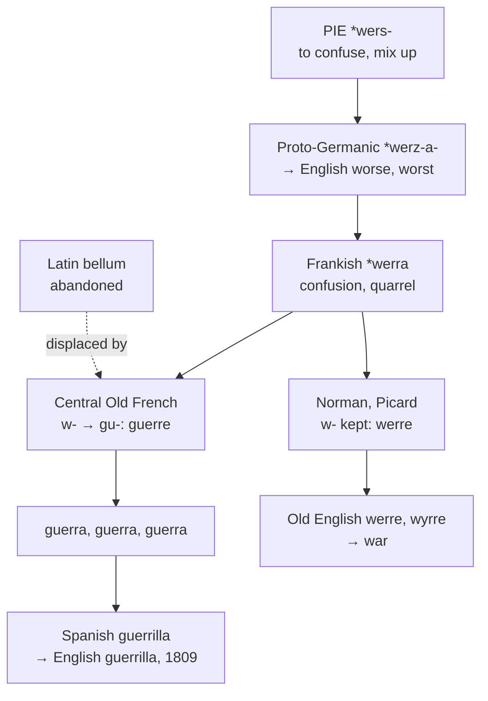

# \**Werra*: confusion, and the letter Normandy dropped

A study of a word that began by meaning *a mess*, of the Germanic languages that had no word for war at all, of the Latin word abandoned for sounding too pretty, and of a consonant that divides France down the middle.

---

## 1. The root

Frankish \**werra* meant "confusion, quarrel, riot, tumult" — not organised fighting but disorder. It descends from Proto-Germanic \**werz-a-*, from Proto-Indo-European **\*wers-** "to confuse, to mix up."

The Germanic cognates keep the older sense throughout:

| Language | Word | Meaning |
|---|---|---|
| Old Saxon | *werran* | to confuse |
| Old High German | *werran* | to confuse; *werra*, strife, scandal |
| German | *verwirren* | to confuse, perplex |
| Dutch | *warren* | to tangle |

And the same root, by the ordinary English development, gives **worse** and **worst**. War and worsening are one word: things going badly, descending into a mess.

---

## 2. Nobody had a word for it

The Oxford English Dictionary put the situation plainly in 1921: *"It is a curious fact that no Germanic nation in early historic times had in living use any word properly meaning 'war.'"*

Old English had **wīg** and **gūþ**, both meaning battle or combat, and both lost. What the Germanic languages lacked was a term for the general condition — the state of hostilities as opposed to any particular fight.

**And Latin gave its own away.** Classical Latin had *bellum*, a perfectly serviceable word, and Romance abandoned it. The usual explanation is phonetic: in Vulgar Latin *bellum* was converging on *bellus* "beautiful," and a language cannot afford to say *war* and *pretty* with the same syllable. Alternative accounts suggest *bellum* described orderly Roman campaigns and fitted post-Roman fighting badly, or that it acquired taboo associations.

Whatever the cause, the result is that **the Romance languages went to the Germans for a word meaning war, at the same time as the Germanic languages had none to lend that meant quite that.** What they borrowed was *werra*, "a mess," and made it do.

*Bellum* survives in English only in the learned vocabulary — *bellicose*, *belligerent*, *antebellum*, *casus belli* — never as the ordinary noun.

---

## 3. The letter that divides France

Germanic *w-* had two fates in Gallo-Romance, and the line between them runs across northern France.

**Central Old French** turned initial Germanic *w-* into *gu-*: *werra* became **guerre**.

**Norman and Picard** kept the *w-*: *werra* stayed **werre**.

England borrowed from Normandy, so English has *war*. Spain, Portugal, and Italy borrowed the Central French form, so they have *guerra*.

The split runs through the whole vocabulary, and because English borrowed from both dialects at different dates, it holds a set of doublets in which the same word appears twice:

| Norman *w-* | Central French *gu-* | One Germanic word |
|---|---|---|
| **ward** | **guard** | \**wardōn* |
| **warden** | **guardian** | \**wardōn* |
| **warranty** | **guarantee** | \**warjan* |
| **wile** | **guile** | \**wigilōn* |
| **wicket** | *guichet* | \**wik-* |
| **William**, **Walter** | *Guillaume*, *Gauthier* | \**wiljahelmaz* |

**And this word too.** English *war* is the Norman form; English **guerrilla**, borrowed from Spanish in 1809 during the Peninsular War, is the Central French form of the identical word, taken by a long road through Iberia. A *guerrilla* is a *little guerra* — a small war — and no English speaker hears the connection.

English also took the word wrong. In Spanish *guerrilla* is the fighting and *guerrillero* the fighter; English applied the first to the person and has used it that way ever since.

---

## 4. The comparative set

| | War | The fighter | Irregular warfare | Initial |
|---|---|---|---|---|
| **Frankish** | \**werra* | — | — | *w-* |
| **French** | *la guerre* | *le guerrier* | *la guérilla* | *gu-* |
| **Spanish** | *la guerra* | *el guerrero* | *la guerrilla* | *gu-* |
| **Portuguese** | *a guerra* | *o guerreiro* | *a guerrilha* | *gu-* |
| **Italian** | *la guerra* | *il guerriero* | *la guerriglia* | *gu-* |
| **Catalan** | *la guerra* | *el guerrer* | *la guerrilla* | *gu-* |
| **English** | *the war* | *the warrior* | *the guerrilla* | *w-* |
| **Inglisce** | *þe guare* | *þe guarior* | *þa guerrilla* | *gu-* |

**Every Romance language in the table has *gu-* and English alone has *w-*.** The difference is not a matter of descent but of which Frenchmen each language happened to deal with.

**Two languages stayed out.** German uses *Krieg*, from a native word meaning exertion or stubbornness, and Romanian uses *războiul*, from Slavic *razboj*. Neither took the Frankish word, though German is the language that supplied it.

**The agent noun is Romance, not Germanic.** *Warrior* is Old North French *werreieor*, from *werreier* "to make war" — so English's word for a fighter is a French formation on a Frankish stem, and its cognates are *guerrier*, *guerrero*, and *guerriero*.

---

## 5. The Inglisce forms

| English | Inglisce |
|---|---|
| war | `guare` |
| warcraft | `guarcraft` |
| warrior | `guarior` |

**Only the `g` is irregular.** `U` is the system's letter for /w/, so `uare` would already read /wɔr/ on its own. The `g` is silent, and it is the single addition.

It is not arbitrary. The `g` records the Central French treatment that produced *guerre*, *guerra*, and *guerriero*, and that English missed only because the Normans were on the wrong side of an isogloss. Writing it puts `guare` and `guarior` beside every cognate they have, and beside the English words that already carry it — *guardian*, *guarantee*, *guerrilla* — which are the same Germanic consonant in the same French disguise.

The alternative would be to write `uare` and keep the word alone in Europe, correct about how it reached England and silent about what it is.

**The vowel is regular, and English shows it too.** `Guare` is /wɔr/, and the `a` is /ɔ/ because a /w/ precedes it — the same rule that gives *warm*, *ward*, *warn*, *swarm*, *quarter*, and *dwarf* their vowel. English writes *war* and *warm* with the letter `a` and pronounces /ɔ/ in both, so nothing here is new; the spelling simply keeps the letter and lets the preceding glide do its ordinary work.

**The silent `-e` covers noun and verb.** English has *war* for both — *to war* is attested from the twelfth century — and `guare` writes them alike.

**`Guarior` takes the Latin agentive `-or`**, where English writes `-ior` for the same suffix in *warrior* and *savior* but `-er` elsewhere. `Guarcraft` keeps the native second element, `craft` being Old English *cræft* and no part of the Romance material.

`Guerrilla` is kept as Spanish wrote it, doubled `r`, doubled `l` and all, being a nineteenth-century borrowing that never passed through French or through English sound change. It is feminine, `þa`.

### The same root, without the detour

| English | Inglisce |
|---|---|
| worse | `uirse` |
| worst | `uirst` |

*Worse* and *worst* descend from the same Proto-Indo-European \**wers-* as *war*, but they never left the language. Old English *wiersa* and *wierrest* are the inherited comparative and superlative of the root, and no Frank, Norman, or Spaniard had anything to do with them.

The spellings record that. `Uirse` and `uirst` have the plain `u` — the system's letter for /w/ — because nothing was ever added to them. `Guare` has the `g` because it went to Gaul and came back.

So one root gives three spellings in the lexicon, and each says where the word has been:

| Form | Route | Spelling |
|---|---|---|
| `uirse`, `uirst` | inherited, unbroken | `u-` |
| `guare`, `guarior` | Frankish → Central French → borrowed back | `gu-` |
| `guerrilla` | Frankish → French → Spanish → borrowed | `gu-`, Spanish shape intact |

English writes *worse* and *war* with different vowels and the same consonant, and gives no sign that they are one word. Inglisce writes them with the same consonant sound and different letters, and the difference is the itinerary.
