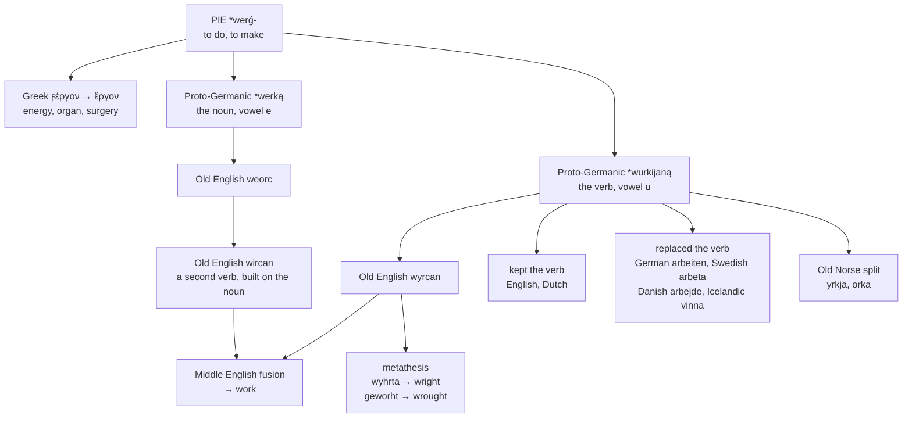

# \**Werką*: the noun, the verb, and the moved *r*

A study of a root that gave Germanic two words and Greek one, of the three English forms that are all the same verb, and of the everyday verb that most of Germanic threw away and English kept.

---

## 1. The root

Proto-Indo-European **\*werǵ-** "to do, to make" is one of the roots that reached English twice — once through Germanic without a break, and once through Greek and Latin as learned vocabulary.

**The Germanic line** gives Proto-Germanic \**werką*, a neuter noun, and \**wurkijaną*, a verb. From these come every word in the tables below.

**The Greek line** runs through ἔργον *érgon*. The Greek word had an initial digamma — ϝέργον — which is the same *w* that Germanic kept, so *work* and *érgon* are the same word with the same first consonant, one of them lost. From *érgon* English has:

**energy**, **erg**, **ergonomic**, **organ**, **organic**, **allergy**, **liturgy**, **metallurgy**, **georgic**, **surgery**, **surgeon**.

A **surgeon** is a *kheir-ourgós*, a hand-worker; the second half of the word is *work*. So *work* and *surgery* are one word, arriving in English five thousand years and two language families apart.

---

## 2. Two Germanic formations, and an English fusion

Proto-Germanic made a noun and a verb from the root, with different vowels:

| | Form | Vowel |
|---|---|---|
| noun | \**werką* | *e* |
| verb | \**wurkijaną* | *u* |

Old English inherited both, as **weorc** and **wyrcan**.

Then something untidy happened. Beside *wyrcan* — the inherited verb, with past *worhte* and participle *geworht* — Old English also formed a **second verb directly from the noun**, Mercian *wircan*, "to operate, to function, to set in motion."

Modern English *work* is a fusion of the two. The OED notes that the vowel of the modern noun was itself reshaped by the verb, so that the *e* of *weorc* and *werk* was pushed out by forms in *u* and *i* borrowed back from the verb it had generated.

The noun's original vowel survives all around English — German *Werk*, Dutch *werk*, Swedish *verk*, Danish *værk*, Icelandic *verk* — and only English lost it.

---

## 3. The moved *r*

English holds three forms of this verb, and two of them have had a consonant travel across a vowel.

**Wright** is Old English *wryhta*, itself a variant of an earlier *wyhrta* "maker," from *wyrcan*. The *r* and the vowel exchanged places.

**Wrought** is the old past participle *geworht*, which became *wroht* by the same movement and then *wrought*.

**Worked** is the later regular form, first attested in the fifteenth century, and *wrought* survives beside it in the crafts — *wrought iron*, *wrought silver* — and in the phrase *what hath God wrought*.

The same metathesis affected a small set of English words, and the list is worth having:

| Modern | Older |
|---|---|
| **third** | *þridda* |
| **thirty** | *þritig* |
| **bird** | *bridd* |
| **thresh**, **thrash** | *þerscan* |
| **nostril** | *nosþyrl*, "nose-hole" |
| **wright**, **wrought** | *wyhrta*, *geworht* |

So *work*, *wright*, and *wrought* are one verb in three shapes, and a *playwright* is not a writer of plays but a *worker* of them — which is why the word is not spelled *playwrite*.

### The *w* that stopped being said

Both metathesised forms begin with a cluster English no longer pronounces. Old English *wr-* was /wr/ — the *w* was fully sounded — and it fell silent between about 1600 and 1700, leaving a letter that does nothing.

The class is large and mostly coherent: *write*, *wrong*, *wrap*, *wreck*, *wrist*, *wring*, *wreath*, *wrath*, *wren*, *wrench*, *wrestle*, *wriggle*, *wrinkle*, *wry*, *wrought*, *wright*. Many of them carry a sense of twisting or bending, and those go back to a different root, \**wer-* "to turn"; *wrought* and *wright* belong to \**werǵ-* instead and merely share the cluster.

English kept the *w* in the spelling of all of them.

**Bulwark** belongs here too: *bole* "tree trunk" plus *werk*, a rampart of logs. Through Dutch *bolwerk* and French *boulevard* it also gives English **boulevard**, so a tree-lined avenue and a defensive wall are the same compound.

---

## 4. Across Germanic

### The noun

| Language | Form |
|---|---|
| **Proto-Germanic** | \**werką* |
| **Gothic** | *gawaurki* |
| **Old English** | *weorc*, *worc* |
| **Old Saxon** | *werk* |
| **Old High German** | *werc* |
| **Old Frisian** | *werk* |
| **Old Norse** | *verk* |
| **German** | *das Werk* |
| **Dutch** | *het werk* |
| **Swedish** | *verket* |
| **Danish** | *værket* |
| **Icelandic** | *verkið* |
| **English** | *the work* |
| **Inglisce** | *þe uirc*, *uêx* |

The noun survived everywhere, and everywhere but England it kept its *e*.

### The verb

| Language | Form | Everyday verb for "to work" |
|---|---|---|
| **Proto-Germanic** | \**wurkijaną* | — |
| **Gothic** | *waurkjan* | *waurkjan* |
| **Old English** | *wyrcan*, *wircan* | *wyrcan* |
| **Old Saxon** | *wirkian* | *wirkian* |
| **Old High German** | *wurken* | *wurken* |
| **Old Norse** | *yrkja*, *orka* | *vinna* |
| **German** | *wirken*, *werken* | **arbeiten** |
| **Dutch** | *werken* | *werken* |
| **Swedish** | *yrka*, *orka*, *verka* | **arbeta** |
| **Danish** | *virke* | **arbejde** |
| **Icelandic** | *yrkja* | **vinna** |
| **English** | *to work* | *to work* |
| **Inglisce** | *to uirche* | *to uirche* |

**Most of Germanic replaced the verb and English did not.** German, Swedish, and Danish all took *arbeiten*, *arbeta*, *arbejde* from Proto-Germanic \**arbaidiz* "toil, hardship" — a word connected to \**h₃erbʰ-* "to change status," which also gives English *orphan*. Their everyday word for work is therefore built on a term for bereavement and drudgery.

Icelandic went to *vinna*, from \**winnaną* "to struggle, to toil," which is the same verb as English *win*.

Only English and Dutch kept the inherited verb as the ordinary one. The others left it in the narrow senses: German *wirken* is "to have an effect," Swedish *verka* is "to seem, to act," Danish *virke* is "to function."

**Old Norse split it in two.** \**Wurkijaną* gave both *yrkja* and *orka*, and Swedish still has both — *yrka* "to urge, to demand" and *orka* "to have the strength for." Icelandic *yrkja* narrowed differently again and means **to compose poetry**: a poet works verse.

---

## 5. The Inglisce forms

| English | Inglisce |
|---|---|
| to work | `to uirche` |
| I work, she works | `I uirc`, `sie uircs` |
| worked | `uirched` |
| working | `uirching` |
| the work | `þe uirc` |
| the works | `þe uêx` |

**`Ch` writes the Germanic dorsal.** The digraph is /k/, and it marks a velar of Germanic descent — the same treatment given to *make*, *bake*, *break*, and *cook*. The `u` is the system's letter for /w/, and `ir` gives /ɝ/, so `uirche` is /wɝk/.

**The digraph needs a following front vowel, and the paradigm works around it.** `Uirche`, `uirched`, and `uirching` all supply one. The bare present does not, and there the spelling falls back on plain `c`: `uirc`, `uircs`.

| | Form | Spelling of /k/ |
|---|---|---|
| infinitive | `uirche` | `ch` + silent `e` |
| present | `uirc`, `uircs` | `c` |
| past | `uirched` | `ch` + `e` |
| progressive | `uirching` | `ch` + `i` |

The noun takes the same plain `c` as the bare verb, giving `þe uirc` — the pair `uirc` : `uirche` matching the noun and verb of the other Germanic verbs in the lexicon.

**`Uêx` restores the vowel English lost.** The Germanic noun had *e* — *weorc*, *werk*, *Werk*, *verk*, *værk* — and English alone replaced it with the vowel of the verb. The plural writes it back, and `x` gives /ks/ in one letter.

So the two forms of the noun carry the two histories: `uirc` shows what the verb did to it, and `uêx` shows what it was before.

### The metathesised forms

| English | Inglisce | Part of speech |
|---|---|---|
| wrought | `r̃oht` | adjective only |
| playwright | `playrîhte` | noun |

**`R̃` marks the *r* of a lost *wr-*.** English writes a `w` that has not been pronounced for three centuries; the tilde records that the consonant was there and states that it is not said. The letter that survives is the one still heard.

**`R̃oht` is an adjective and nothing else.** English *wrought* is formally the old past participle, but it long ago stopped serving as one — the past of *work* is *worked*, and *wrought* survives only in *wrought iron*, *wrought silver*, and a few fixed phrases. Inglisce completes the split that English left half-made: `uirched` is the past and `r̃oht` is the adjective, with no overlap.

**`Playrîhte` keeps the *ht* of *wyrhta*.** English writes `gh` here, a digraph that once spelled a velar fricative and now spells nothing at all; `h` states the same silence with one letter instead of two, and it is the letter Old English actually used.

**And it carries no tilde**, though its *r* has the same lost *w* behind it. A word takes one diacritic, and the vowel outranks the consonant: `playrîhte` needs the circumflex to fix its `î` as /aɪ/, and having spent the mark there it does not also spell the silent *w*. `R̃oht` has a plain `o` that needs nothing, so the tilde is free to appear.

The priority is the right way round. A reader who misses the tilde loses a fact about the eleventh century; a reader who misses the circumflex cannot pronounce the word.

The distinction matters more than it looks. English has four words pronounced /raɪt/ — *right* from *riht*, *rite* from *rītus*, *write* from *wrītan*, and *wright* from *wyrhta* — and spells them four ways for four different reasons, only some of which record anything. The `ht` of `playrîhte` records the cluster the word had in Old English.
