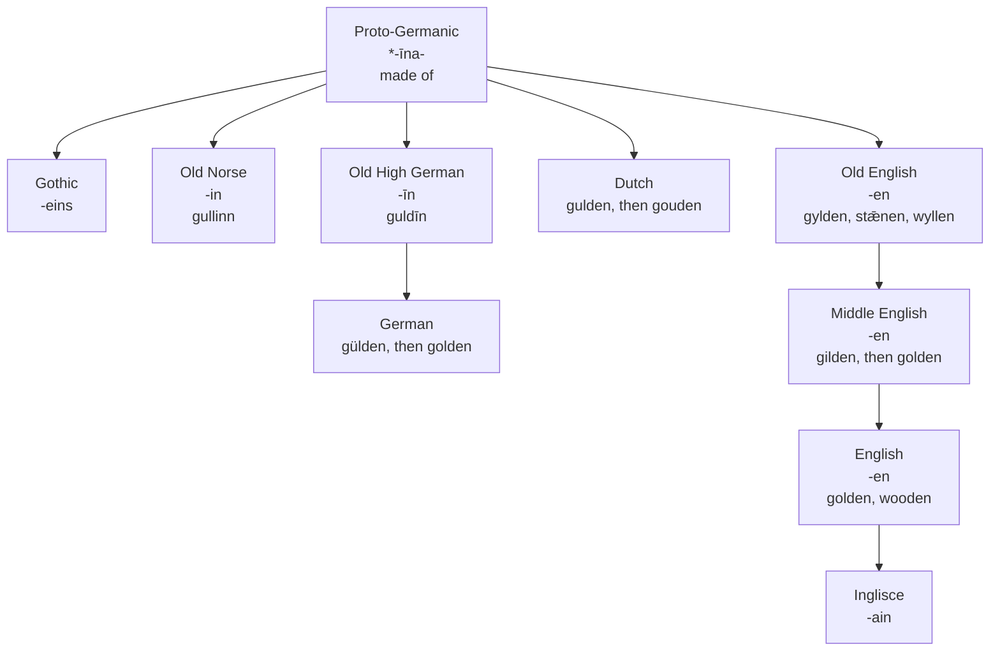

# *-īna-*: the suffix that gilded gold

A study of the English "made of" suffix, from a vowel that altered its noun to a spelling that sets it beside Latin.

---

## 1. The root

The suffix of *golden*, *wooden* and *earthen* forms adjectives of material from nouns: gold, wood, earth. Etymonline traces it to Proto-Germanic *\*-ina-*, from the Proto-Indo-European adjectival suffix *\*-no-*. The Germanic vowel was long. The OED gives the older form as *\*-īno-*, continued as Old High German *-īn*, Old Saxon and Old Norse *-in*, and Gothic *-eina-*, where *ei* is the Gothic spelling of long *ī*.

The same formation appears in the sister branches. The OED and Merriam-Webster set Latin *-īnus* and Greek *-inos* beside the Germanic suffix. Etymonline adds Latin *-ānus*. None of these is an ancestor of the English suffix. They are the same Indo-European device, built independently in each branch.

In Germanic the suffix specialised. The OED notes that its adjectives "chiefly indicate the material of which a thing is composed."

---

## 2. The vowel that coloured the noun

A long *ī* in a suffix does not sit quietly. In the prehistory of Old English, an *i* or *j* in a following syllable pulled the stressed vowel before it towards the front of the mouth: *u* became *y*, and *ā* became *ǣ*. This is i-mutation, the change behind *mūs* and *mȳs*, *mouse* and *mice*.

The *-īn-* suffix triggered it in every noun it could. The Middle English Dictionary describes these adjectives as formed on mass nouns "orig. with mutation of the root vowel":

- *gold* gave *gylden*
- *stān* "stone" gave *stǣnen*
- *wull* "wool" gave *wyllen*

For gold the suffix did double work. The noun *gold* goes back to *\*gulþą*, whose *u* was lowered to *o* by the *a* of the ending. The adjective *\*gulþīnaz* escaped that lowering, because its suffix had no *a*, and was fronted instead by the *ī*. By Old English the noun and its adjective had different root vowels, *gold* against *gylden*, and the suffix responsible had itself reduced to *-en*.

---

## 3. Rebuilt on the plain noun

Middle English did not keep the mutated adjectives. It built new ones on the noun as it stood. Etymonline dates *golden* to about 1300, "replacing Middle English *gilden*." The OED describes the whole class: the new adjectives "took the place of OE. words, from which they formally differ only by the absence of umlaut." Its examples are *gylden* against *golden*, and *stǣnen*, early Middle English *stenen*, against *stonen*. The Middle English Dictionary gives *wollen* formed afresh from *wol*, where Old English had *wyllen*.

The old form lingered for a while as a poet's word. Spenser's bull of 1590 still has *gilden horns*.

English was not alone. Dutch had *gulden*, from Old Dutch *\*guldīn*. Once *gold* had become *goud* in Middle Dutch, the adjective no longer sounded like its noun, and Middle Dutch built *gouden* on *goud*. *Gulden* survives beside it, above all as the name of a coin. In German, *gulden* was long the ordinary adjective, and it gave way first to *gülden*, then to *golden*. In each language the suffix had pulled the adjective's vowel away from the noun's, and each language later rebuilt the adjective on the noun.

---

## 4. A class that thinned

Rebuilding did not save the class. Etymonline lists what Old and Middle English could say with it: *fyren* "made of fire," *rosen* "of roses," *hunden* "of dogs," *beanen*, *tinnen*, *breaden*, *yewen*. Wycliffe has *reeden*, "made of reeds."

The OED dates the retreat to the sixteenth century, when literary English began to use the bare noun instead: *a gold watch*, not *a golden watch*. By the time of its first edition, only *wooden*, *woollen*, *earthen* and *wheaten* were still in familiar literal use. *Golden* and *silvern* survived mainly in metaphor. South-western dialects were the exception: they still added the suffix freely, as in *glassen*, *steelen*, *tinnen*, *papern*.

Even the survivors are mostly rebuilds. *Wooden* is not an Old English word. Etymonline dates it to the 1530s, formed on *wood*, and it displaced *treen*, the Middle English continuation of Old English *trēowen*, "made of tree." Within thirty years *wooden* also meant "stiff, clumsy." The survivors that kept a figurative sense kept it firmly: *brazen*, from Old English *bræsen* "of brass," meant "hardened in effrontery" by the 1570s.

---

## 5. The comparative set

| | The suffix | The adjective of gold | What the form records |
|---|---|---|---|
| Old English | *-en* | *gylden* | The suffix's *i* has fronted the root, *u* to *y*, while the noun has *o* |
| Old High German | *-īn* | *guldīn* | The long vowel still written; the root keeps the *u* the noun had lowered to *o* |
| Middle English | *-en* | *gilden*, then *golden* | The mutated adjective inherited, then replaced by one built on the noun |
| German | *-en* | *gulden*, *gülden*, then *golden* | The inherited adjective, a variant with the fronted vowel marked, then a rebuild on *Gold* |
| Dutch | *-en* | *gulden*, then *gouden* | The inherited adjective, rebuilt on *goud* once the two had drifted apart |
| English | *-en* | *golden* | The rebuilt form: the suffix no longer touches its noun |
| Inglisce | *-ain* | — | A spelling chosen for correspondence with Latin rather than for descent |

**Reading the third column down:** every language whose adjective had moved away from its noun brought it back. English rebuilt *golden* in the fourteenth century, Middle Dutch rebuilt *gouden*, and German arrived at *golden* by way of *gülden*. None of them borrowed the repair from another. What survives in all three is a suffix that attaches to a noun without changing it. That is the reverse of what the suffix did when it was young.

---

## 6. The Inglisce form

The Inglisce suffix is *-ain*. It is unstressed, like the English *-en* it replaces, and like the final syllable of *villain* and *captain* it is spoken /ən/. In *wooden* many speakers have no vowel at all: Random House transcribes the word /ˈwʊd n/, with a syllabic *n*, and Collins gives /ˈwʊdən/.

The spelling does not record a route. The suffix never passed through Latin or French; it is Germanic at every stage from Proto-Germanic to English. What *-ain* records is correspondence. Etymonline sets the Germanic suffix beside Latin *-ānus*. French *-ain* and *-aine* are the regular outcomes of *-ānus* and *-āna*, as *lāna* gives *laine* and *rōmānum* gives *romain*. Writing the English suffix *-ain* spells it the way the descendants of its Latin counterpart are spelt. The link is between siblings, not between parent and child, and the spelling claims nothing more.

English gives this suffix no spelling of its own. The *-en* of *golden* is written exactly like the *-en* of *darken*, which makes verbs; the *-en* of *taken*, which marks the past participle; and the *-en* of *oxen*, which marks a plural. Four distinct endings share two letters, and only the grammar of the word tells them apart. The Inglisce spelling is chosen for the adjective alone.
